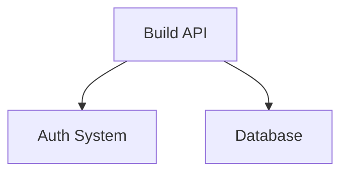

# clausidian API Reference

完整的命令行接口 (CLI) 和 MCP 工具文档。所有命令均支持 `--json` 标志返回结构化数据。

**目录:**
- [CRUD 操作](#crud-操作) — 创建、读取、更新、删除笔记
- [搜索与浏览](#搜索与浏览) — 全文搜索、标签、关系图
- [知识管理](#知识管理) — 日志、评论、归档
- [批量操作](#批量操作) — 批量标签、更新、归档
- [导出导入](#导出导入) — 备份和恢复
- [配置与维护](#配置与维护) — 初始化、同步、验证
- [错误处理](#错误处理) — 常见错误和解决方案

---

## CRUD 操作

### `clausidian init <path>`

初始化新的 agent-friendly vault。

**参数:**
- `<path>` — vault 目录路径 (必需)

**返回:**
```json
{
  "success": true,
  "vault": "/path/to/vault",
  "created": [
    "00-INBOX",
    "10-AREAS",
    "20-PROJECTS",
    "30-RESOURCES",
    "40-IDEAS",
    "50-ARCHIVE",
    "_tags.md",
    "_graph.md"
  ]
}
```

**示例:**
```bash
clausidian init ~/my-vault
cd ~/my-vault
```

---

### `clausidian note <title> <type> [--tags TAG1,TAG2] [--summary "..."]`

创建新笔记，自动链接相关笔记。

**参数:**
- `<title>` — 笔记标题 (必需)
- `<type>` — 笔记类型: `area` | `project` | `resource` | `idea` (必需)
- `--tags TAG1,TAG2` — 逗号分隔的标签
- `--summary "..."` — 单行总结
- `--goal "..."` — 项目目标 (仅用于 project)

**返回:**
```json
{
  "success": true,
  "filename": "build-api",
  "path": "20-PROJECTS/build-api.md",
  "title": "Build API",
  "type": "project",
  "tags": ["backend", "api"],
  "related": ["[[api-design]]", "[[auth-system]]"]
}
```

**示例:**
```bash
# 创建项目笔记
clausidian note "Build REST API" project --tags "backend,api" --summary "Core API gateway"

# 创建想法
clausidian note "Use vector search for retrieval" idea --tags "ml,optimization"

# 创建资源笔记
clausidian note "Go Error Handling Patterns" resource --tags "golang,patterns"
```

**Frontmatter 结构:**
```yaml
---
title: "Build REST API"
type: project
tags: [backend, api]
status: active
created: 2026-03-30
updated: 2026-03-30
summary: "Core API gateway"
related: []
---
```

---

### `clausidian capture <idea> [--tags TAG1,TAG2]`

快速捕捉想法，自动添加时间戳。

**参数:**
- `<idea>` — 想法文本 (必需)
- `--tags TAG1,TAG2` — 可选标签

**返回:**
```json
{
  "success": true,
  "filename": "capture-20260330-143022",
  "timestamp": "2026-03-30T14:30:22Z"
}
```

**示例:**
```bash
clausidian capture "Refactor search to use embeddings" --tags "ml,performance"
```

---

### `clausidian read <note> [--section "Heading"]`

读取笔记的完整内容。

**参数:**
- `<note>` — 笔记文件名 (不含 .md)
- `--section "Heading"` — 可选: 仅读取此标题下的内容

**返回:**
```json
{
  "title": "Build API",
  "type": "project",
  "tags": ["backend", "api"],
  "status": "active",
  "body": "...",
  "sections": {
    "Overview": "...",
    "Requirements": "..."
  }
}
```

**示例:**
```bash
# 读取整个笔记
clausidian read build-api

# 仅读取一个章节
clausidian read build-api --section "Requirements"

# JSON 输出用于脚本处理
clausidian read build-api --json | jq .body
```

---

### `clausidian update <note> --status active|draft|archived [--summary "..."]`

更新笔记的 frontmatter。

**参数:**
- `<note>` — 笔记文件名 (必需)
- `--status` — 新状态
- `--summary` — 新的单行总结
- `--tags` — 新的标签
- `--related` — 相关笔记列表

**返回:**
```json
{
  "success": true,
  "note": "build-api",
  "updated": {
    "status": "active",
    "updated": "2026-03-30"
  }
}
```

**示例:**
```bash
clausidian update build-api --status active --summary "Core API with auth"
clausidian update old-project --status archived
clausidian update my-idea --tags "ml,optimization,performance"
```

---

### `clausidian patch <note> --heading "Section" [--append|--prepend|--replace] <content>`

编辑笔记的特定章节（添加、前置或替换）。

**参数:**
- `<note>` — 笔记文件名 (必需)
- `--heading` — 目标章节 (必需)
- `--append` — 在章节末添加内容
- `--prepend` — 在章节头添加内容
- `--replace` — 替换整个章节

**示例:**
```bash
# 在 "Implementation" 章节末添加
clausidian patch build-api --heading "Implementation" --append "- Add JWT validation"

# 创建新章节
clausidian patch build-api --heading "Tasks" --append "- [ ] Design endpoints\n- [ ] Write tests"

# 替换整个章节
clausidian patch build-api --heading "Requirements" --replace "- Must handle concurrent requests\n- Support OAuth2"
```

---

### `clausidian delete <note>`

删除笔记及清理所有引用。

**参数:**
- `<note>` — 笔记文件名 (必需)

**返回:**
```json
{
  "success": true,
  "deleted": "build-api",
  "cleaned": ["ref-in-other-note"]
}
```

**示例:**
```bash
clausidian delete old-draft
```

---

### `clausidian rename <note> <new-title>`

重命名笔记并更新所有引用。

**参数:**
- `<note>` — 原始笔记名 (必需)
- `<new-title>` — 新标题 (必需)

**返回:**
```json
{
  "success": true,
  "old": "build-api",
  "new": "api-gateway",
  "referencesUpdated": 5
}
```

**示例:**
```bash
clausidian rename build-api "API Gateway"
```

---

### `clausidian move <note> <new-type>`

将笔记移动到不同类型的目录。

**参数:**
- `<note>` — 笔记文件名 (必需)
- `<new-type>` — 新类型: `area` | `project` | `resource` | `idea` (必需)

**返回:**
```json
{
  "success": true,
  "note": "my-idea",
  "from": "40-IDEAS",
  "to": "20-PROJECTS"
}
```

**示例:**
```bash
# 将想法提升为项目
clausidian move my-idea project

# 将项目转为资源（保存为参考）
clausidian move completed-project resource
```

---

### `clausidian merge <source> <target>`

合并两个笔记（合并内容和标签）。

**参数:**
- `<source>` — 源笔记文件名 (必需)
- `<target>` — 目标笔记文件名 (必需)

**返回:**
```json
{
  "success": true,
  "merged": {
    "source": "draft-api",
    "target": "build-api",
    "tagsAdded": ["draft"]
  }
}
```

**示例:**
```bash
# 将草稿合并到主项目
clausidian merge draft-api build-api
```

---

### `clausidian archive <note>`

将笔记状态设为 archived（等价于 `update <note> --status archived`）。

**参数:**
- `<note>` — 笔记文件名 (必需)

**返回:**
```json
{
  "success": true,
  "archived": "completed-project",
  "status": "archived"
}
```

**示例:**
```bash
clausidian archive completed-project
```

---

## 搜索与浏览

### `clausidian search <keyword> [--type area|project|resource|idea] [--tag TAG] [--regex]`

全文搜索（支持 BM25 算法和正则表达式）。

**参数:**
- `<keyword>` — 搜索关键词 (必需)
- `--type` — 筛选笔记类型
- `--tag` — 筛选标签
- `--regex` — 使用正则表达式模式
- `--limit N` — 限制结果数（默认: 10）

**返回:**
```json
{
  "results": [
    {
      "filename": "build-api",
      "title": "Build API",
      "type": "project",
      "score": 8.5,
      "excerpt": "Core API gateway for...",
      "tags": ["backend", "api"]
    }
  ],
  "total": 1,
  "time": "12ms"
}
```

**示例:**
```bash
# 简单搜索
clausidian search "API"

# 筛选类型
clausidian search "performance" --type project

# 筛选标签
clausidian search "golang" --tag "patterns"

# 正则表达式
clausidian search "API.*v[23]" --regex

# 限制结果
clausidian search "database" --limit 5 --json
```

---

### `clausidian list <type> [--status active|draft|archived] [--tag TAG]`

列出特定类型的笔记。

**参数:**
- `<type>` — 笔记类型: `area` | `project` | `resource` | `idea` (必需)
- `--status` — 筛选状态
- `--tag` — 筛选标签
- `--limit N` — 限制条数

**返回:**
```json
{
  "type": "project",
  "notes": [
    {
      "filename": "build-api",
      "title": "Build API",
      "status": "active",
      "tags": ["backend", "api"],
      "created": "2026-03-30",
      "updated": "2026-03-30"
    }
  ],
  "total": 1
}
```

**示例:**
```bash
# 所有活跃项目
clausidian list project --status active

# 所有想法
clausidian list idea

# 特定标签的资源
clausidian list resource --tag "golang" --json
```

---

### `clausidian backlinks <note>`

显示指向此笔记的所有反向链接。

**参数:**
- `<note>` — 笔记文件名 (必需)

**返回:**
```json
{
  "note": "build-api",
  "backlinks": [
    {
      "source": "api-design",
      "context": "See also [[build-api]] for..."
    }
  ],
  "total": 1
}
```

**示例:**
```bash
clausidian backlinks build-api
```

---

### `clausidian neighbors <note> [--depth 2]`

探索笔记的关系网络（N 度关联）。

**参数:**
- `<note>` — 笔记文件名 (必需)
- `--depth N` — 关系深度（默认: 2）

**返回:**
```json
{
  "note": "build-api",
  "neighbors": {
    "direct": ["auth-system", "error-handling"],
    "distance-2": ["jwt-tokens", "http-clients"]
  }
}
```

**示例:**
```bash
clausidian neighbors build-api --depth 3
```

---

### `clausidian graph [--format mermaid|json] [--filter tag=api]`

生成知识图（Mermaid 图表或 JSON）。

**参数:**
- `--format` — 输出格式: `mermaid` | `json` (默认: mermaid)
- `--filter` — 筛选条件 (e.g., `tag=api`)
- `--depth N` — 关系深度

**返回:**


**示例:**
```bash
# 生成完整关系图
clausidian graph

# JSON 格式用于可视化工具
clausidian graph --format json

# 仅显示 "api" 标签的笔记
clausidian graph --filter tag=api

# 生成 Mermaid 并导入到 Obsidian
claudidian graph > graph.md
```

---

### `clausidian tag list`

列出所有标签及使用次数。

**参数:** 无

**返回:**
```json
{
  "tags": [
    { "tag": "backend", "count": 5 },
    { "tag": "api", "count": 3 },
    { "tag": "golang", "count": 2 }
  ],
  "total": 3
}
```

**示例:**
```bash
clausidian tag list
```

---

### `clausidian tag rename <old> <new>`

重命名标签（更新所有笔记）。

**参数:**
- `<old>` — 原标签 (必需)
- `<new>` — 新标签 (必需)

**返回:**
```json
{
  "success": true,
  "old": "backend",
  "new": "backend-dev",
  "updated": 5
}
```

**示例:**
```bash
clausidian tag rename "old-tag" "new-tag"
```

---

### `clausidian orphans`

找出没有入站链接的孤立笔记。

**参数:** 无

**返回:**
```json
{
  "orphans": [
    {
      "filename": "random-idea",
      "title": "Random Idea",
      "type": "idea",
      "created": "2026-03-15"
    }
  ],
  "total": 1
}
```

**示例:**
```bash
clausidian orphans
```

---

### `clausidian duplicates [--threshold 0.4]`

找出相似度高的重复笔记。

**参数:**
- `--threshold` — 相似度阈值 0-1（默认: 0.4）

**返回:**
```json
{
  "duplicates": [
    {
      "group": 1,
      "notes": ["build-api", "api-development"],
      "similarity": 0.82
    }
  ]
}
```

**示例:**
```bash
clausidian duplicates
clausidian duplicates --threshold 0.6
```

---

## 知识管理

### `clausidian journal [--date YYYY-MM-DD]`

创建或打开今日日志（或指定日期的日志）。

**参数:**
- `--date YYYY-MM-DD` — 指定日期（默认: 今天）

**返回:**
```json
{
  "success": true,
  "filename": "journal-2026-03-30",
  "path": "50-JOURNAL/journal-2026-03-30.md",
  "date": "2026-03-30"
}
```

**示例:**
```bash
# 今日日志
clausidian journal

# 往回看 3 天
clausidian journal --date 2026-03-27
```

---

### `clausidian review [--type monthly|weekly|quarterly] [--days N]`

生成知识总结（周、月、季度）。

**参数:**
- `--type` — 评论类型: `weekly` | `monthly` | `quarterly` (默认: weekly)
- `--days N` — 回顾天数

**返回:**
```json
{
  "review": "weekly-2026-03-30",
  "period": "2026-03-24 to 2026-03-30",
  "sections": {
    "achievements": ["Completed API design", "Fixed 3 bugs"],
    "learnings": ["Vector search is faster than BM25"],
    "next": ["Implement auth", "Write docs"]
  }
}
```

**示例:**
```bash
# 周评论
clausidian review

# 月度评论
clausidian review --type monthly

# 季度评论
clausidian review --type quarterly
```

---

### `clausidian timeline [--days N] [--type project|idea]`

显示活动时间线。

**参数:**
- `--days N` — 回顾天数（默认: 7）
- `--type` — 筛选笔记类型

**返回:**
```json
{
  "timeline": [
    {
      "date": "2026-03-30",
      "events": [
        { "action": "created", "note": "build-api" },
        { "action": "updated", "note": "auth-system" }
      ]
    }
  ]
}
```

**示例:**
```bash
# 最近 7 天
clausidian timeline

# 最近 30 天的项目活动
clausidian timeline --days 30 --type project
```

---

### `clausidian recent [--limit N] [--type PROJECT]`

显示最近修改的笔记。

**参数:**
- `--limit N` — 限制条数（默认: 10）
- `--type` — 筛选笔记类型

**返回:**
```json
{
  "recent": [
    {
      "filename": "build-api",
      "title": "Build API",
      "updated": "2026-03-30T14:30:00Z"
    }
  ]
}
```

**示例:**
```bash
clausidian recent
clausidian recent --limit 5 --type project
```

---

### `clausidian daily`

显示今日仪表板（待办、活跃项目、今日日志）。

**参数:** 无

**返回:**
```json
{
  "today": "2026-03-30",
  "journal": "journal-2026-03-30",
  "tasks": [
    { "title": "[ ] Review API design", "note": "build-api" }
  ],
  "activeProjects": ["build-api", "auth-system"],
  "newIdeas": 2
}
```

**示例:**
```bash
clausidian daily
```

---

### `clausidian agenda [--all]`

显示所有待办任务。

**参数:**
- `--all` — 包含已完成的任务

**返回:**
```json
{
  "pending": [
    {
      "title": "Design endpoints",
      "note": "build-api",
      "checked": false
    }
  ],
  "completed": []
}
```

**示例:**
```bash
clausidian agenda
clausidian agenda --all
```

---

### `clausidian suggest`

AI 推荐改进建议。

**参数:** 无

**返回:**
```json
{
  "suggestions": [
    {
      "type": "stale",
      "note": "old-project",
      "message": "No updates in 45 days",
      "score": 0.8
    },
    {
      "type": "link",
      "notes": ["build-api", "api-design"],
      "message": "Should be related",
      "score": 0.7
    }
  ]
}
```

**示例:**
```bash
clausidian suggest
clausidian suggest --limit 10 --json
```

---

### `clausidian pin <note>`

标记为收藏。

**参数:**
- `<note>` — 笔记文件名 (必需)

**返回:**
```json
{
  "success": true,
  "pinned": "build-api"
}
```

**示例:**
```bash
clausidian pin build-api
clausidian pin list
clausidian unpin build-api
```

---

## 批量操作

### `clausidian batch tag --type project --add "important"`

为多个笔记添加标签。

**参数:**
- `--type` — 笔记类型
- `--tag` — 筛选标签（仅处理有此标签的笔记）
- `--add TAG` — 添加标签
- `--remove TAG` — 删除标签

**返回:**
```json
{
  "success": true,
  "updated": 3,
  "notes": ["build-api", "auth-system", "database"]
}
```

**示例:**
```bash
# 为所有项目添加 "important" 标签
clausidian batch tag --type project --add "important"

# 为有 "ml" 标签的笔记删除 "draft" 标签
clausidian batch tag --tag "ml" --remove "draft"
```

---

### `clausidian batch update --type project --set-status active`

批量更新笔记 frontmatter。

**参数:**
- `--type` — 笔记类型
- `--set-status` — 新状态
- `--tag` — 筛选标签

**返回:**
```json
{
  "success": true,
  "updated": 5
}
```

**示例:**
```bash
# 归档所有想法
clausidian batch update --type idea --set-status archived

# 激活 "golang" 标签的所有资源
clausidian batch update --tag "golang" --set-status active
```

---

### `clausidian batch archive --tag "deprecated"`

批量归档笔记。

**参数:**
- `--type` — 笔记类型
- `--tag` — 筛选标签

**返回:**
```json
{
  "success": true,
  "archived": 2
}
```

**示例:**
```bash
clausidian batch archive --tag "deprecated"
clausidian batch archive --type idea
```

---

## 导出导入

### `clausidian export [vault-backup.json] [--format markdown|json] [--type project]`

导出 vault 内容。

**参数:**
- `[filename]` — 输出文件（默认: 生成文件名）
- `--format` — 格式: `json` | `markdown` (默认: json)
- `--type` — 仅导出此类型

**返回:**
```json
{
  "exported": 42,
  "file": "vault-backup-2026-03-30.json",
  "size": "2.3MB"
}
```

**示例:**
```bash
# 导出为 JSON 备份
clausidian export vault-backup.json

# 导出为 Markdown（便于版本控制）
clausidian export --format markdown --type project

# 导出所有项目
clausidian export projects.json --type project
```

---

### `clausidian import notes.json`

导入笔记。

**参数:**
- `<file>` — 输入文件 (必需)

**返回:**
```json
{
  "success": true,
  "imported": 10,
  "skipped": 0
}
```

**示例:**
```bash
clausidian import vault-backup.json
```

---

## 配置与维护

### `clausidian sync`

重建所有索引（`_tags.md`, `_graph.md`, 目录索引）。

**参数:** 无

**返回:**
```json
{
  "success": true,
  "indexed": 42,
  "files": ["_tags.md", "_graph.md", "10-AREAS/_index.md"]
}
```

**示例:**
```bash
clausidian sync
```

---

### `clausidian validate`

检查 vault 的完整性和质量。

**参数:** 无

**返回:**
```json
{
  "valid": true,
  "issues": [],
  "quality": {
    "completeness": 0.92,
    "organization": 0.88
  }
}
```

**示例:**
```bash
clausidian validate
```

---

### `clausidian broken-links`

找出所有损坏的链接。

**参数:** 无

**返回:**
```json
{
  "broken": [
    {
      "source": "build-api",
      "target": "[[non-existent-note]]",
      "type": "missing"
    }
  ],
  "total": 1
}
```

**示例:**
```bash
clausidian broken-links
```

---

### `clausidian relink [--dry-run]`

自动修复损坏的链接（使用 fuzzy matching）。

**参数:**
- `--dry-run` — 预览建议，不进行修改

**返回:**
```json
{
  "fixed": 2,
  "skipped": 0,
  "changes": [
    {
      "note": "build-api",
      "from": "[[buid-api]]",
      "to": "[[build-api]]"
    }
  ]
}
```

**示例:**
```bash
# 预览
clausidian relink --dry-run

# 执行修复
clausidian relink
```

---

### `clausidian link [--dry-run]`

智能链接相关笔记（自动创建缺失的关系链接）。

**参数:**
- `--dry-run` — 预览建议

**返回:**
```json
{
  "linked": 3,
  "suggestions": [
    {
      "source": "build-api",
      "target": "auth-system",
      "confidence": 0.85
    }
  ]
}
```

**示例:**
```bash
# 预览建议的链接
clausidian link --dry-run

# 创建链接
clausidian link
```

---

### `clausidian stats [--json]`

显示 vault 统计信息。

**参数:**
- `--json` — JSON 输出

**返回:**
```json
{
  "total": 42,
  "byType": {
    "area": 5,
    "project": 10,
    "resource": 15,
    "idea": 12
  },
  "byStatus": {
    "active": 25,
    "draft": 10,
    "archived": 7
  },
  "totalWords": 50000,
  "lastUpdated": "2026-03-30T14:30:00Z"
}
```

**示例:**
```bash
clausidian stats
```

---

### `clausidian health [--json]`

计算 vault 健康分数（质量指标）。

**参数:**
- `--json` — JSON 输出

**返回:**
```json
{
  "score": 0.82,
  "factors": {
    "completeness": 0.9,
    "linkage": 0.75,
    "recency": 0.8
  }
}
```

**示例:**
```bash
clausidian health
```

---

### `clausidian count [--type project] [--json]`

字数统计。

**参数:**
- `--type` — 筛选笔记类型
- `--json` — JSON 输出

**返回:**
```json
{
  "total": 50000,
  "byType": {
    "area": 5000,
    "project": 20000,
    "resource": 15000,
    "idea": 10000
  }
}
```

**示例:**
```bash
clausidian count
clausidian count --type project
```

---

### `clausidian setup <vault-path>`

一次性配置 Claude Code 集成。

**参数:**
- `<vault-path>` — vault 路径 (必需)

**返回:**
```json
{
  "success": true,
  "configured": {
    "mcpServer": "running on port 3001",
    "skill": "/obsidian installed",
    "envFile": ".env.local updated"
  }
}
```

**示例:**
```bash
clausidian setup ~/my-vault
```

---

## 错误处理

### 常见错误

| 错误 | 原因 | 解决方案 |
|------|------|---------|
| `vault not found` | 目录不存在或不是 vault | 运行 `clausidian init <path>` |
| `note not found` | 笔记不存在 | 检查笔记名称（不含 .md）|
| `invalid type` | 类型不是 area/project/resource/idea | 使用有效的类型 |
| `failed to write` | 权限问题或磁盘满 | 检查目录权限 |
| `circular link` | 笔记链接到自己 | 删除自引用 |

### 返回值规范

所有命令都返回 JSON（--json 时）或人类可读文本：

**成功:**
```json
{
  "success": true,
  "data": {...}
}
```

**错误:**
```json
{
  "error": "error message",
  "code": "ERROR_CODE",
  "hint": "suggested fix"
}
```

---

## 全局选项

所有命令都支持：

- `--json` — 返回结构化 JSON
- `--help` — 显示帮助
- `--version` — 显示版本

---

*本文档对应 clausidian v2.5.0+ 版本。更多信息见 [README.md](../README.md)。*
