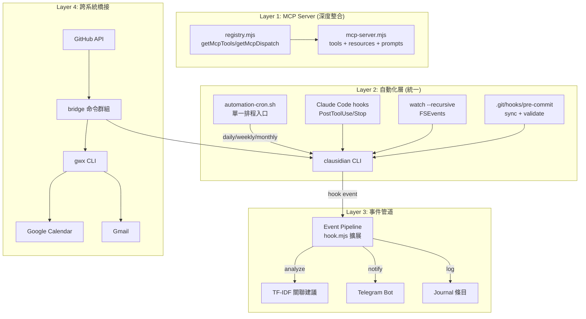
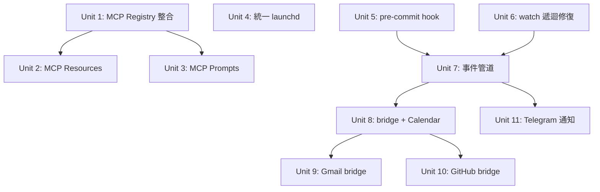

# feat: Obsidian CLI 全面自動化整合

## Overview

將 clausidian CLI 從「功能完整但鬆散耦合」升級為「深度整合的自動化知識管理系統」。三大主軸：

1. **MCP Server 深度整合** — 消除 registry 重複，新增 resources/prompts，讓所有 MCP 客戶端原生存取 vault 上下文
2. **自動化層統一與強化** — 合併雙套 launchd 系統、實作 pre-commit hook、修復 watch 遞迴、建立事件驅動管道
3. **跨系統雙向同步** — Google Workspace（Calendar→journal、Gmail→capture）、GitHub（issue/PR→vault）、Telegram Bot 統一入口

## Problem Frame

現有系統已達 Grade A 健康度（48 筆記，0 orphans），CLI 有 47 命令 + 46 MCP tools。但存在明確的架構債務和整合缺口：

- MCP server 手動維護 TOOLS/DISPATCH 陣列，與 registry 脫節（新命令無法自動出現在 MCP）
- 兩套獨立 launchd 系統並存（`com.dex.obsidian-*` vs `com.clausidian.*`），排程重疊
- `watch` 命令 `{ recursive: false }` 無法偵測子目錄變更
- CLAUDE.md 文檔的 Pre-commit 層未實作
- 跨系統整合仍是手動觸發（無事件驅動管道）

## Requirements Trace

- R1. MCP server 使用 registry 匯出，新增命令自動出現在 MCP
- R2. MCP resources 暴露 `_index.md`、`_tags.md`、`_graph.md` 供客戶端讀取
- R3. MCP prompts 提供常用操作模板（weekly review、daily journal、capture idea）
- R4. 統一 launchd 系統為單一入口（`automation-cron.sh`），消除重複排程
- R5. 實作 git pre-commit hook（sync + validate）
- R6. `watch` 命令支援遞迴監聽
- R7. 事件驅動管道：筆記變更自動觸發分析/摘要/關聯建議
- R8. Google Calendar → journal 自動生成會議筆記
- R9. Gmail digest → vault capture 自動擷取
- R10. GitHub issue/PR 活動 → vault project 筆記同步
- R11. Telegram Bot 統一通知入口（所有自動化事件匯總）

## Scope Boundaries

- **不做：** Obsidian App 插件開發（保持 headless 原則）
- **不做：** 搜尋引擎從線性掃描升級到 SQLite FTS（48 筆記不需要）
- **不做：** 重寫 CLI 框架或引入外部依賴（保持零依賴原則）
- **不做：** Agent Trace System Phase 3b/3c（已有獨立設計，不在此 scope）

## Context & Research

### Relevant Code and Patterns

- `src/registry.mjs` (817 lines) — 所有命令的單一真相來源，已匯出 `getMcpTools()` / `getMcpDispatch()`
- `src/mcp-server.mjs` (219 lines) — 手寫 JSON-RPC 2.0，`TOOLS` 和 `DISPATCH` 是硬編碼副本
- `src/commands/hook.mjs` — 現有 hook 事件處理（session-stop）
- `src/commands/launchd.mjs` — 內建 launchd 安裝（`com.clausidian.*`）
- `automation-cron.sh` — 統一排程入口模式（Golden Principles 確認）
- `src/vault.mjs` — 核心 vault 操作（search、backlinks、orphans）
- `src/index-manager.mjs` — TF-IDF + Union-Find 索引引擎

### Institutional Learnings

- **Golden Principle #1:** Hook 必須用 `stdin JSON`（`INPUT=$(cat)`），不用 `$TOOL_INPUT`
- **Golden Principle #2:** Node.js 路徑必須用 `path.resolve()`（"YD 2026" 有空格）
- **Golden Principle #3:** MCP 配置寫 `.mcp.json`，settings.json 只管 hooks/permissions
- **Golden Principle #4:** LaunchAgent 用 symlink，不複製
- **Golden Principle #5:** Commit 前必查 git status — auto-hook 可能改了預期外的文件
- **Stop hook 已知陷阱:** 無效 `stop_reason` 會產生垃圾記錄，需防禦性解析
- **MCP server 已知問題:** `mcp-server.mjs` 的 `TOOLS`/`DISPATCH` 與 registry 脫節
- **雙套 launchd:** `com.dex.*`（08:00）和 `com.clausidian.*`（23:30）可能重複執行

## Key Technical Decisions

- **MCP server 修復策略：** 直接替換為 `getMcpTools()` / `getMcpDispatch()`，而非重寫整個 server。Rationale: 最小變更，registry 已提供完整介面。
- **launchd 統一方向：** 保留 `com.dex.obsidian-*` 系列（走 `automation-cron.sh`），移除 `com.clausidian.*` 內建排程。Rationale: `automation-cron.sh` 是全局標準入口，24 個任務都走這條路。
- **事件驅動架構：** 擴展現有 `hook` 命令為事件管道（`clausidian hook <event> [--payload json]`），不引入消息隊列。Rationale: 零依賴原則，vault 規模不需要隊列。
- **跨系統整合方式：** 新增 `bridge` 命令群組，使用 registry 的 `subcommands` 模式（如 `batch`/`tag`），讓子命令自動暴露為 MCP tools（`bridge_gcal`、`bridge_gmail`、`bridge_github`）。內部調用 `gwx` CLI。Rationale: 保持 clausidian 為統一入口，gwx 已有 Go 實作；`subcommands` 模式確保 MCP 自動同步。
- **事件管道 stdin 統一：** hook 命令的 stdin JSON 解析提升到 registry 的 `run` 路由層統一處理，各事件函數接收已解析的物件。Rationale: 避免每個事件函數重複 `readFileSync('/dev/stdin')` 邏輯。
- **MCP resources 實作：** 靜態 resources 暴露三個索引文件，無需訂閱機制。Rationale: 索引在每次 sync 時重建，MCP 客戶端按需讀取即可。

## Open Questions

### Resolved During Planning

- **Q: MCP server 是否需要 SDK？** → 不需要。手寫 JSON-RPC 2.0 只有 219 行，加 resources/prompts 預估增加 ~80 行，仍遠小於引入 SDK 的複雜度。
- **Q: watch 遞迴在 macOS 是否穩定？** → 穩定。Node.js `fs.watch({ recursive: true })` 在 macOS 使用 FSEvents，是原生支援的。
- **Q: bridge 命令是否需要認證管理？** → 不需要。gwx CLI 已處理 OAuth，clausidian 只是調用者。

### Deferred to Implementation

- **bridge 命令的具體 gwx 子命令映射** — 需要查看 gwx 最新 API
- **MCP prompts 的具體參數 schema** — 需要看 MCP protocol spec 2024-11-05 的 prompts 能力
- **事件管道的錯誤重試策略** — 取決於各事件來源的失敗模式

## High-Level Technical Design

> *This illustrates the intended approach and is directional guidance for review, not implementation specification. The implementing agent should treat it as context, not code to reproduce.*

## Implementation Units

### Phase 1: MCP Server 修復與增強

- [ ] **Unit 1: MCP Server Registry 整合**

**Goal:** 消除 `mcp-server.mjs` 中的硬編碼 TOOLS/DISPATCH，改用 registry 匯出

**Requirements:** R1

**Dependencies:** None

**Files:**
- Modify: `src/mcp-server.mjs`
- Modify: `src/registry.mjs`（如需調整匯出介面）
- Test: `test/mcp-server.test.mjs`

**Approach:**
- 刪除 `mcp-server.mjs` 中的 `TOOLS` 陣列和 `DISPATCH` 物件
- 替換為 `import { getMcpTools, getMcpDispatch } from './registry.mjs'`
- 確認 `tools/list` 回應使用 `getMcpTools()` 的回傳值
- 確認 `tools/call` 分派使用 `getMcpDispatch()` 的回傳值

**Patterns to follow:**
- 現有 `registry.mjs` 的 `getMcpTools()` 和 `getMcpDispatch()` 匯出模式

**Test scenarios:**
- Happy path: `tools/list` 回傳的工具數量與 `getMcpTools()` 一致
- Happy path: `tools/call` 能正確分派到每個已註冊命令
- Edge case: registry 新增一個命令後，MCP server 無需改動即自動暴露
- Error path: 呼叫不存在的工具名回傳標準 MCP error

**Verification:**
- `clausidian serve` 啟動後，`tools/list` 回傳 46+ 工具
- 新增測試命令到 registry 後，MCP 自動可見

---

- [ ] **Unit 2: MCP Resources — 索引文件暴露**

**Goal:** 讓 MCP 客戶端無需 tool call 即可讀取 vault 上下文

**Requirements:** R2

**Dependencies:** Unit 1

**Files:**
- Modify: `src/mcp-server.mjs`

**Approach:**
- 在 server capabilities 中加入 `resources` 能力
- 實作 `resources/list` — 回傳三個靜態 resource（`vault://index`、`vault://tags`、`vault://graph`）
- 實作 `resources/read` — 根據 URI 讀取對應文件內容
- 資源 MIME type 設為 `text/markdown`

**Patterns to follow:**
- MCP protocol spec 2024-11-05 的 resources 規範
- 現有 `vault.readNote()` 讀取模式

**Test scenarios:**
- Happy path: `resources/list` 回傳 3 個 resource，各有正確的 URI 和名稱
- Happy path: `resources/read` 以 `vault://tags` 為參數，回傳 `_tags.md` 內容
- Error path: `resources/read` 以不存在的 URI 為參數，回傳標準錯誤
- Edge case: 索引文件不存在時（首次使用），回傳空內容而非 crash

**Verification:**
- MCP 客戶端（如 Claude Desktop）能在 context 中看到三個 vault 資源

---

- [ ] **Unit 3: MCP Prompts — 常用操作模板**

**Goal:** 提供預定義的 prompt 模板，簡化常用操作

**Requirements:** R3

**Dependencies:** Unit 1

**Files:**
- Modify: `src/mcp-server.mjs`

**Approach:**
- 在 server capabilities 中加入 `prompts` 能力
- 實作 3 個 prompt：`weekly-review`（觸發周回顧）、`daily-journal`（創建日記）、`capture-idea`（快速捕獲）
- 每個 prompt 定義 `name`、`description`、`arguments`（可選），回傳 `messages` 陣列

**Patterns to follow:**
- MCP protocol spec 的 prompts 規範

**Test scenarios:**
- Happy path: `prompts/list` 回傳 3 個 prompt，各有正確的 schema
- Happy path: `prompts/get` 以 `capture-idea` + `{ text: "test idea" }` 為參數，回傳包含 tool call 的 message
- Edge case: `prompts/get` 不帶可選參數時，回傳合理的預設值

**Verification:**
- MCP 客戶端能列出並使用這三個 prompt

---

### Phase 2: 自動化層統一

- [ ] **Unit 4: 統一 launchd 系統**

**Goal:** 消除雙套 launchd 排程，統一走 `automation-cron.sh`

**Requirements:** R4

**Dependencies:** None

**Files:**
- Modify: `src/commands/launchd.mjs`（移除或標記 deprecated）
- Create: 遷移腳本（一次性）
- Modify: `/Users/dex/YD 2026/scripts/obsidian-daily.sh`（確認覆蓋所有功能）

**Approach:**
- 盤點 `com.clausidian.*` 的功能是否已被 `com.dex.obsidian-*` 完整覆蓋
- 如已覆蓋：`launchctl bootout` 移除 `com.clausidian.*`，更新 `launchd.mjs` 標記為 deprecated
- 如有缺口：補充到 `com.dex.obsidian-*` 的腳本中，再移除
- 更新 `launchd-schedule.md` 文檔

**Patterns to follow:**
- Golden Principle #4: LaunchAgent 用 symlink
- 現有 `automation-cron.sh` 單一入口模式

**Test scenarios:**
- Happy path: 執行 `obsidian-daily.sh` 涵蓋原 `com.clausidian.daily-backfill` 的所有功能
- Happy path: `launchctl list | grep obsidian` 只顯示 `com.dex.obsidian-*` 系列
- Error path: 移除後，原 daily-backfill 23:30 排程不再觸發
- Integration: 日報功能在新排程下正常產出

**Verification:**
- `launchctl list | grep clausidian` 無結果
- `com.dex.obsidian-daily` 的功能清單完整涵蓋所有需求

---

- [ ] **Unit 5: 實作 git pre-commit hook**

**Goal:** 填補 CLAUDE.md 文檔化但未實作的 Pre-commit 層

**Requirements:** R5

**Dependencies:** None

**Files:**
- Create: `.git/hooks/pre-commit`（或使用 `clausidian` 子命令安裝）
- Modify: `src/commands/hook.mjs`（新增 `pre-commit` 事件）

**Approach:**
- pre-commit hook 腳本：呼叫 `clausidian sync` + `clausidian validate`
- 如果 validate 回報 frontmatter 不完整，阻止 commit 並顯示缺失欄位
- sync 結果（索引變更）自動 `git add` 到本次 commit

**Patterns to follow:**
- Golden Principle #5: commit 前檢查 git status
- 現有 `hook.mjs` 的事件處理模式

**Test scenarios:**
- Happy path: 有完整 frontmatter 的 commit 順利通過
- Error path: 缺少 `title` 或 `type` 的筆記阻止 commit，輸出缺失欄位
- Integration: sync 產生的 `_tags.md` / `_graph.md` 變更自動包含在 commit 中
- Edge case: 非 vault 目錄下的 commit 不觸發（只在 obsidian/ 子目錄有變更時）

**Verification:**
- 故意提交一個缺少 frontmatter 的筆記，commit 被拒絕

---

- [ ] **Unit 6: watch 命令遞迴修復**

**Goal:** 讓 `watch` 能偵測所有子目錄的文件變更

**Requirements:** R6

**Dependencies:** None

**Files:**
- Modify: `src/commands/watch.mjs`（或 `src/vault.mjs` 中的 `fsWatch` 調用）

**Approach:**
- 將 `fs.watch(path, { recursive: false })` 改為 `fs.watch(path, { recursive: true })`
- 加入 debounce（300ms）避免重複觸發 sync
- 過濾 `.git/` 和 `node_modules/` 目錄的變更

**Patterns to follow:**
- 現有 watch 命令的事件處理邏輯

**Test scenarios:**
- Happy path: 修改 `areas/health.md`，watch 偵測到並觸發 sync
- Happy path: 修改 `journal/2026-03-30.md`，watch 偵測到
- Edge case: 快速連續修改 3 個文件，debounce 合併為一次 sync
- Edge case: `.git/` 目錄的變更不觸發 sync

**Verification:**
- 啟動 `clausidian watch`，在任意子目錄建立新筆記，確認 sync 自動執行

---

### Phase 3: 事件驅動管道

- [ ] **Unit 7: 擴展 hook 命令為事件管道**

**Goal:** 讓 `clausidian hook <event>` 成為通用事件處理入口，統一 stdin 解析

**Requirements:** R7

**Dependencies:** Unit 5, Unit 6

**Files:**
- Modify: `src/commands/hook.mjs`（新增事件處理函數）
- Modify: `src/commands/watch.mjs`（接線：偵測到變更時 spawn hook 事件）
- Modify: `src/registry.mjs`（hook `run` 中統一 stdin JSON 解析，各事件函數接收已解析物件）

**Approach:**
- 在 registry 的 hook `run` 函數中統一 `readFileSync('/dev/stdin')` + `JSON.parse`，將解析結果傳入各事件函數，消除重複
- 擴展 hook 命令支援更多事件：`note-created`、`note-updated`、`note-deleted`、`index-rebuilt`
- 每個事件接收 JSON payload：`{ event, note, changes, timestamp }`
- 事件處理邏輯：
  - `note-created` → 自動搜尋相關筆記，建議 related 連結
  - `note-updated` → 如果 tags 變更，觸發 TF-IDF 重新計算該筆記的建議關聯
  - `index-rebuilt` → 通知 Telegram Bot（可選）
- watch.mjs 接線：偵測到文件變更時，識別變更類型（create/update/delete），spawn `clausidian hook note-created|note-updated|note-deleted` 並傳入 JSON payload
- PostToolUse hook 同樣作為事件來源

**Patterns to follow:**
- 現有 `hook session-stop` 的處理模式
- Golden Principle #1: stdin JSON 輸入

**Test scenarios:**
- Happy path: `echo '{"event":"note-created","note":"test-note"}' | clausidian hook note-created` 回傳關聯建議
- Happy path: `note-updated` 事件觸發後，`_graph.md` 的 Suggested Links 更新
- Error path: 無效 JSON payload 輸出錯誤訊息但不 crash
- Error path: hook 處理失敗不阻斷主流程（事件處理是 best-effort）
- Integration: watch 偵測到文件變更後，自動觸發對應 hook 事件
- Integration: watch → hook note-created → TF-IDF 建議 → stdout 輸出完整管道

**Verification:**
- 建立新筆記後，自動收到相關筆記建議（stdout 或 notification）
- watch 啟動中修改子目錄文件，確認事件管道端到端觸發

---

### Phase 4: 跨系統橋接

- [ ] **Unit 8: bridge 命令框架 + Google Calendar 整合**

**Goal:** 建立 bridge 命令群組，首先實作 Calendar → journal 的會議筆記自動生成

**Requirements:** R8

**Dependencies:** Unit 7

**Files:**
- Create: `src/commands/bridge.mjs`
- Modify: `src/registry.mjs`（註冊 bridge 命令群組）

**Approach:**
- bridge 使用 registry 的 `subcommands` 模式，結構如 `{ name: 'bridge', subcommands: { gcal: { mcpName: 'bridge_gcal', ... }, gmail: {...}, github: {...} } }`，確保子命令自動暴露為 MCP tools
- `clausidian bridge gcal [--date today]` — 呼叫 `gwx calendar list-events` 取得當日會議
- 對每個會議，在 journal 條目中生成「會議」區塊（時間、參與者、議程）
- 如果已有 journal 條目，append 而非覆蓋
- 可整合到 daily cron（08:00 自動執行）

**Patterns to follow:**
- gwx CLI 的命令格式和 JSON 輸出
- 現有 `journal` 命令的筆記生成模式

**Test scenarios:**
- Happy path: 有 3 個會議的日子，journal 產生 3 個會議區塊
- Edge case: 無會議的日子，不修改 journal
- Edge case: journal 已有內容，新增的會議區塊正確 append
- Error path: gwx 未安裝或未認證，輸出清晰錯誤訊息
- Integration: `obsidian-daily.sh` 中加入 `bridge gcal` 步驟

**Verification:**
- 執行 `clausidian bridge gcal`，journal 中出現當日會議資訊

---

- [ ] **Unit 9: Gmail digest → vault capture**

**Goal:** 自動從 Gmail 擷取重要郵件摘要到 vault

**Requirements:** R9

**Dependencies:** Unit 8（共用 bridge 框架）

**Files:**
- Modify: `src/commands/bridge.mjs`
- Modify: `src/registry.mjs`

**Approach:**
- `clausidian bridge gmail [--label important] [--days 1]` — 呼叫 `gwx gmail search-messages`
- 對每封符合條件的郵件，使用 `capture` 命令建立 idea 筆記（或 append 到 journal）
- 標籤映射：Gmail label → vault tag
- 可整合到 daily cron

**Patterns to follow:**
- Unit 8 的 bridge 模式
- 現有 `capture` 命令的格式

**Test scenarios:**
- Happy path: 有 2 封 important 郵件，產生 2 個 capture 條目
- Edge case: 無新郵件，不產生任何操作
- Error path: gwx gmail 認證過期，輸出提示重新認證
- Edge case: 重複執行不產生重複 capture（基於 message ID 去重）

**Verification:**
- 執行後，vault 中出現對應 Gmail 摘要的 idea 或 journal 條目

---

- [ ] **Unit 10: GitHub 活動 → vault 同步**

**Goal:** GitHub issue/PR 活動自動同步到 vault project 筆記

**Requirements:** R10

**Dependencies:** Unit 8（共用 bridge 框架）

**Files:**
- Modify: `src/commands/bridge.mjs`
- Modify: `src/registry.mjs`

**Approach:**
- `clausidian bridge github [--repo owner/repo] [--days 1]` — 呼叫 `gh` CLI
- 同步活動類型：新 issue、PR merged、release published
- 對應 vault 行為：
  - 新 issue → 更新 project 筆記的「Open Issues」區塊
  - PR merged → 更新 project 筆記的「最近進展」
  - Release → 建立 resource 筆記（changelog 摘要）
- 可整合到 daily 或 weekly cron

**Patterns to follow:**
- `gh` CLI 的 JSON 輸出（`--json`）
- 現有 project 筆記的區塊結構

**Test scenarios:**
- Happy path: 過去 24h 有 1 個 merged PR，project 筆記的「最近進展」更新
- Edge case: 無活動時，不修改任何筆記
- Error path: repo 不存在或 `gh` 未認證，輸出清晰錯誤
- Integration: 自動同步的筆記包含正確的 frontmatter 和 related 連結

**Verification:**
- 執行後，目標 project 筆記中出現最新 GitHub 活動摘要

---

- [ ] **Unit 11: Telegram Bot 統一通知入口**

**Goal:** 所有自動化事件匯總到 Telegram 通知

**Requirements:** R11

**Dependencies:** Unit 7

**Files:**
- Modify: `src/notify.mjs`（擴展通知管道）
- Modify: `src/commands/hook.mjs`（事件觸發通知）

**Approach:**
- 擴展 `notify.mjs`：除 macOS Notification Center 外，加入 Telegram Bot 管道
- 使用現有 `obsidian-journal-sync.mjs` 的 Telegram 接口（已在 claude_code_telegram_bot 中實作）
- 事件到通知的映射：
  - `index-rebuilt` → 靜默（不通知）
  - `note-created`（重要筆記）→ Telegram 摘要
  - daily/weekly/monthly cron 完成 → Telegram 報告
  - bridge 同步完成 → Telegram 摘要
- 通知失敗不阻斷主流程

**Patterns to follow:**
- 現有 `obsidian-journal-sync.mjs` 的 5 種模式
- 現有 npm-publish / git-push logger 的通知模式

**Test scenarios:**
- Happy path: weekly cron 完成後，Telegram 收到「周回顧完成」訊息
- Error path: Telegram API 不可用，fallback 到 macOS notification
- Edge case: `index-rebuilt` 事件不產生 Telegram 通知（過於頻繁）
- Integration: bridge 同步完成後，Telegram 收到同步摘要

**Verification:**
- 手動觸發一個高優先級事件，Telegram 收到通知

---

## Implementation Unit Dependency Graph

**並行策略：**
- Phase 1（U1→U2, U3）和 Phase 2（U4, U5, U6）可完全並行
- Phase 3（U7）等 U5 + U6 完成
- Phase 4（U8-U11）等 U7 完成，但 U9/U10/U11 可並行

## System-Wide Impact

- **Interaction graph:** MCP server 現在依賴 registry（已有），新增 resources/prompts 路由。hook.mjs 成為事件管道中心，被 watch、PostToolUse、bridge 觸發。bridge 依賴外部 CLI（gwx、gh）。
- **Error propagation:** 所有事件處理和跨系統橋接必須 best-effort — 失敗記錄到日誌但不阻斷主流程。pre-commit hook 是唯一的 blocking 路徑（validate 失敗阻止 commit）。
- **State lifecycle risks:** bridge 同步需要冪等性 — 重複執行不應產生重複筆記。使用 message ID / issue number 作為去重鍵。
- **API surface parity:** MCP server 修復後，CLI 和 MCP 完全同步。bridge 命令同時在 CLI 和 MCP 可用。
- **Integration coverage:** bridge 命令依賴外部 CLI（gwx、gh）的可用性和認證狀態，需要在每個 bridge 子命令入口做前置檢查。
- **Unchanged invariants:** 現有 47 個 CLI 命令的行為不變。現有 hook（PostToolUse sync、Stop session-stop）不變。零依賴原則不變。

## Risks & Dependencies

| Risk | Mitigation |
|------|------------|
| gwx CLI 版本更新改變輸出格式 | bridge 命令解析 JSON 輸出時做防禦性解析，版本固定 |
| Telegram Bot token 洩露 | token 從環境變量讀取，不硬編碼。`.env` 已在 `.gitignore` |
| pre-commit hook 過慢影響 commit 體驗 | sync + validate 對 48 筆記 < 1 秒。如超過 2 秒，改為 async 並允許 `--no-verify` bypass |
| MCP resources 文件讀取路徑問題 | 遵循 Golden Principle #2，使用 `path.resolve()` 處理空格路徑 |
| 雙套 launchd 移除時遺漏功能 | 遷移前完整比對兩套系統的功能清單，建立 checklist |

## Documentation / Operational Notes

- 完成後更新 `CLAUDE.md` 的自動化層表格
- 更新 `launchd-schedule.md` 反映統一後的排程
- 更新 `ai-automation.md` area 筆記的系統總覽
- bridge 命令需要在 README 中加入 prerequisite（gwx、gh CLI）
- MCP resources/prompts 需要在 SKILL.md 中更新能力清單

## Sources & References

- Related code: `src/registry.mjs`, `src/mcp-server.mjs`, `src/commands/hook.mjs`, `src/commands/launchd.mjs`
- Related vault notes: `resources/launchd-schedule.md`, `resources/golden-principles.md`, `areas/ai-automation.md`
- Related memory: `obsidian-automation.md`, `agent-engineering-session.md`
- External: gwx CLI (`projects/gwx.md`), Telegram Bot (`claude_code_telegram_bot`)
