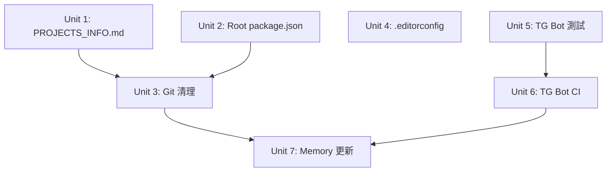

# refactor: YD 2026 全面治理

## Overview

YD 2026 工作區存在嚴重的結構性問題：root git status 有大量半完成的重組（staged renames + unstaged deletions）、root package.json 身份錯亂、生產項目（Telegram Bot）零測試零 CI、全工作區無 linting/formatting 基建。此計畫分四階段治理：

- **Phase 1（清理結構）：** Units 1-2（PROJECTS_INFO.md + package.json）
- **Phase 2（修復 git）：** Unit 3（依賴 Phase 1）
- **Phase 3（品質基建）：** Unit 4（.editorconfig，可與 Phase 2 平行）
- **Phase 4（加固高風險）：** Units 5-7（TG Bot 測試 + CI + Memory，可與 Phase 2 平行）

## Problem Frame

工作區在快速迭代中累積了大量技術債：
1. **幽靈引用**：舊 CLAUDE.md/PROJECTS_INFO.md 引用已不存在的 dexapi/test-ydapi/watermark-0324（CLAUDE.md 已修正，PROJECTS_INFO.md 待更新）
2. **Root git 混亂**：root repo 有半完成的重組（60 staged renames + 96 staged adds + 68 staged deletions + 64 unstaged deletions），git status 極度混亂
3. **零品質門檻**：沒有 linting、formatting、pre-commit hooks — 代碼品質完全靠人工
4. **Telegram Bot 是定時炸彈**：82 個文件、14 個 cron job、零測試套件、零 CI — 生產系統無安全網
5. **Root package.json 身份錯亂**：名為 `session-wrap-skill` v3.9.0，與實際 session-wrap-skill 項目衝突

## Requirements Trace

- R1. PROJECTS_INFO.md 反映實際項目結構（GWX、TG Bot、NS_0327）
- R2. Root git status 乾淨 — 無幽靈刪除、untracked 只有合理項目
- R3. Root package.json 正確反映工作區身份或移除
- R4. 工作區有 .editorconfig 統一編碼風格
- R5. Telegram Bot 有基本測試套件（核心模組 + config）
- R6. Telegram Bot 有 CI pipeline（GitHub Actions）
- R7. Memory 文件更新反映新項目結構

## Scope Boundaries

- **不動** gwx — 它已成熟（68 test files, CI, lint, AGENTS.md）
- **不動** NS_0327 — 實驗項目，15 pytest files 已足夠
- **不動** session-wrap-backend — 低優先，不在此次範圍
- **不動** session-wrap-skill npm 發布 — root package.json 修改前需確認是否仍參與 npm publish（若已遷移到 `projects/tools/session-wrap-skill/` 則安全清理）
- **不做** TypeScript 遷移 — 改動量太大，留給未來
- **不做** Telegram Bot 模組化重構 — 只加測試和 CI，不改現有結構
- **不做** 依賴掃描（Dependabot/Renovate）— 留給下一輪

## Context & Research

### Relevant Code and Patterns

- `projects/production/gwx/.github/workflows/ci.yml` — 成熟 CI 範本（race detection, cross-platform, lint）
- `projects/production/claude_code_telegram_bot/smoke-test.mjs` — 現有煙霧測試（只驗語法，不驗邏輯）
- `projects/production/claude_code_telegram_bot/config.mjs` — 集中配置
- `projects/production/claude_code_telegram_bot/core.mjs` — 核心共用模組
- `projects/tools/ctx/.github/workflows/test.yml` — 輕量 Node.js CI 範本
- `.zshrc-workspace` — 已更新的別名系統

### Institutional Learnings

- gwx 的 CI 模式是最佳實踐：`go test -race ./...` + `go vet` + matrix build
- Telegram Bot 用 `node:test`（built-in）比引入 Jest 更適合 — 零依賴
- Root repo 和子項目各自獨立 `.git` — 這是設計如此，不是 bug

## Key Technical Decisions

- **Telegram Bot 測試框架用 `node:test`**：Node.js 內建，零依賴，與 clausidian 一致。不引入 Jest/Vitest 以避免依賴膨脹
- **Root package.json 改為工作區元數據**：重命名為 `yd-2026-workspace`，移除 session-wrap 相關的 bin/scripts/files，保留為工作區級腳本入口
- **Git 清理分三步處理**：(1) 已 staged 的 renames/moves（server/→projects/tools/session-wrap-skill/ 等）直接 commit (2) unstaged deletions 用 `git rm --cached` (3) 更新 .gitignore 防止復發
- **.editorconfig 而非 Prettier**：跨語言（Go/JS/Python/Shell）統一縮進和編碼，不引入 JS-specific 工具鏈

## Open Questions

### Resolved During Planning

- **Q: Telegram Bot 該用什麼測試框架？** → `node:test`（built-in），與 clausidian 保持一致
- **Q: 幽靈文件怎麼處理？** → 三步分類：(1) commit staged renames (2) `git rm --cached` unstaged deletions (3) 更新 .gitignore
- **Q: Telegram Bot 本輪測試哪些模組？** → config.mjs（pure functions）+ core.mjs（需 mock execSync）。Cron job 腳本留給下一輪。
- **Q: Root package.json 與 session-wrap-skill 的關係？** → 前置檢查確認是否仍參與 npm publish，再決定是否清理

### Deferred to Implementation

- **Q: core.mjs 的 Clausidian 類在 Node 20 下能否穩定 mock？** → 視實際 node:test mock API 行為決定，fallback 為只測靜態方法
- **Q: Root repo 的 untracked NS_0327 目錄是否該 gitignore？** → 視 git status 清理後的狀態決定

## Implementation Units

> **三條平行軌道：** (A) U1+U2 → U3 | (B) U4 獨立 | (C) U5→U6 獨立 | U7 等 A+C 完成

- [ ] **Unit 1: 修正 PROJECTS_INFO.md**

**Goal:** PROJECTS_INFO.md 反映實際項目結構

**Requirements:** R1

**Dependencies:** None

**Files:**
- Modify: `PROJECTS_INFO.md`

**Approach:**
- 替換 P1/P2/P3/P4 為 GWX / TG Bot / NS_0327
- 更新路徑、快速命令、技術棧描述
- 保留統一開發流程和狀態檢查段落（更新別名）
- 對齊 CLAUDE.md 已修正的內容

**Patterns to follow:**
- 新 CLAUDE.md 的 Projects 表格格式

**Test expectation:** none — 純文檔更新

**Verification:**
- PROJECTS_INFO.md 中不再出現 dexapi、test-ydapi、watermark-0324
- 所有列出的路徑都指向存在的目錄

---

- [ ] **Unit 2: 修正 Root package.json**

**Goal:** Root package.json 正確反映工作區身份

**Requirements:** R3

**Dependencies:** None

**Files:**
- Modify: `package.json`

**Approach:**
- **前置檢查**：確認 root package.json 是否仍參與 `npm publish`（檢查 `projects/tools/session-wrap-skill/package.json` 是否已獨立）。若 root 仍是發布源，保持不動
- 若安全：name 改為 `yd-2026-workspace`
- 移除 session-wrap 相關的 bin（9 個 entries）、files、description
- 移除現有 scripts（wrap、sync）— 不新增工作區腳本（.zshrc-workspace 已提供所有別名）
- version 改為 `1.0.0`（工作區本身不發布）
- 設為 `private: true`

**Patterns to follow:**
- monorepo root package.json 慣例（name + private + scripts）

**Test expectation:** none — 配置修改

**Verification:**
- `npm pack --dry-run` 不再嘗試打包 session-wrap 文件
- package.json 的 name 和實際用途一致

---

- [ ] **Unit 3: 清理 Root Git Status**

**Goal:** Root git status 乾淨，無幽靈刪除，已 staged 的重組正確提交

**Requirements:** R2

**Dependencies:** Unit 1, Unit 2（文檔和 package.json 改動需一起提交）

**Files:**
- Modify: `.gitignore`
- Commit staged: 60 renames（server/→projects/tools/session-wrap-skill/ 等）+ 96 adds + 68 deletions
- Remove from tracking: 64 unstaged deletions（remotion-clip/、sub2api-deploy/、舊腳本等）

**Approach:**

三步分類處理（**不可盲目 `git rm --cached` 全部文件**）：

1. **Step A — 提交已 staged 的重組**：先 `git diff --cached --stat` 檢視，確認 60 renames（如 server/* → projects/tools/session-wrap-skill/server/*）和 docs/ 搬遷是合理的，然後 commit。這是之前重組工作的收尾。
2. **Step B — 處理 unstaged deletions**：對 64 個 ` D` 狀態文件分類：
   - remotion-clip/（~55 files）、sub2api-deploy/（~5 files）→ 確認是已廢棄的實驗項目後 `git rm --cached`
   - 其他散落的舊腳本和配置 → `git rm --cached`
   - 先 `git rm --cached -n` dry-run 確認無誤
3. **Step C — 更新 .gitignore**：加入新的分類段落（# Archived / Experimental subprojects），覆蓋不該追蹤的目錄模式，防止復發

提交策略：Step A 單獨一個 commit（保留 rename tracking history），Step B+C 一個 commit。

**Patterns to follow:**
- 現有 .gitignore 的分類風格（Dependencies / Environment / OS / IDE），新增 `# Subprojects` 段落

**Test scenarios:**
- Happy path: `git status` 運行後只顯示本次有意的改動，無 `D` 前綴文件
- Happy path: `git log --diff-filter=R` 顯示 rename 歷史被正確保留
- Edge case: 確認 `git rm --cached` 不影響子項目的 `.git` 倉庫
- Edge case: 確認 docs/ 下的新文件（已從頂層搬入 docs/）被正確追蹤
- Edge case: remotion-clip 和 sub2api-deploy 被正確 untrack

**Verification:**
- `git status` 輸出中無 ` D` 前綴行
- `.gitignore` 覆蓋所有不該追蹤的模式
- rename history 可通過 `git log --follow` 追溯

---

- [ ] **Unit 4: 加入 .editorconfig**（opportunistic — 低成本，順手做）

**Goal:** 統一跨語言編碼風格

**Requirements:** R4

**Dependencies:** None（獨立軌道，可與其他 Unit 平行）

**Files:**
- Create: `.editorconfig`

**Approach:**
- root = true
- 默認：utf-8, lf, 2 spaces, trim trailing whitespace, insert final newline
- Go：tab indent（Go 慣例）
- Python：4 spaces（PEP 8）
- Makefile：tab indent
- Markdown：不 trim trailing whitespace（有意義的尾部空格）

**Patterns to follow:**
- editorconfig.org 官方建議

**Test scenarios:**
- Happy path: `.editorconfig` 存在且格式正確
- Edge case: Go 文件使用 tab、Python 文件使用 4 spaces、JS/Shell 使用 2 spaces

**Verification:**
- `cat .editorconfig` 顯示正確的語言分段
- 各語言規則互不衝突

---

- [ ] **Unit 5: Telegram Bot 基本測試套件**

**Goal:** TG Bot 有核心模組的單元測試

**Requirements:** R5

**Dependencies:** None（與 U1-U3 平行執行）

**Files:**
- Create: `projects/production/claude_code_telegram_bot/tests/config.test.mjs`
- Create: `projects/production/claude_code_telegram_bot/tests/core.test.mjs`
- Modify: `projects/production/claude_code_telegram_bot/package.json`（加 test script）

**Approach:**

模組可測試性分析（基於實際代碼結構）：
- **config.mjs — 安全直接 import**：只做 path resolve 和 pure function 導出（fmtNum、pct、todayStr、domainDaysLeft），不讀文件、不呼叫 API。GA4_CREDENTIALS_PATH 只是 resolve 路徑，不會 crash。
- **core.mjs — 需要 mock**：Clausidian 類構造時呼叫 `execSync`（mkdir、agent-trace.sh）、`appendFileSync`（logging）、動態 import `tg-utils.mjs`。需要 mock 這些 side effects。
- **Mocking 策略**：用 `node:test` 的 `mock` API mock `execSync` 和 `appendFileSync`。若 Node 20 的 module mock 不穩定，改為只測 config.mjs 的 pure functions + core.mjs 的靜態方法，跳過需要構造 Clausidian 的測試。
- **時間相關函數**：todayStr()、isWeekday()、domainDaysLeft() 用 `mock.timers` 或只測類型/形狀（returns string / number）

測試目標優先級：
1. ✅ config.mjs pure functions（fmtNum, pct, todayStr 等）— 零 mock 需求
2. ✅ config.mjs 導出結構（必要欄位鍵名存在）— 零 mock 需求
3. ⚠️ core.mjs Clausidian 類 — 需 mock execSync，視 Node 版本決定
4. ❌ cron job 腳本（morning-briefing、ga4-daily-report、site-health 等）— 本輪不測，留給下一輪

**Patterns to follow:**
- `projects/tools/clausidian/tests/` 的 `node:test` 用法

**Test scenarios:**
- Happy path: config.mjs 的 fmtNum(1234) → '1,234'、pct(0.5) → '50.0%'
- Happy path: config.mjs 導出包含 BOT_TOKEN、CHAT_ID、GA4_PROPERTY_ID 等欄位鍵名
- Happy path: todayStr() 返回 YYYY-MM-DD 格式字串
- Error path: config.mjs 在缺少 HOME 環境變量時不 crash（有 fallback）
- Edge case: 測試可以在沒有 .env、GA4 key file、真實 Telegram token 的環境下運行
- Integration: import config.mjs 後所有導出值類型正確（string/number/function）

**Verification:**
- `cd projects/production/claude_code_telegram_bot && npm test` 通過
- 測試不依賴外部服務（Telegram API、GA4）
- Node 20 和 Node 22 下都能跑

---

- [ ] **Unit 6: Telegram Bot CI Pipeline**

**Goal:** TG Bot 有 GitHub Actions CI

**Requirements:** R6

**Dependencies:** Unit 5

**前置條件：** TG Bot 有獨立 GitHub remote（`github.com/redredchen01/dex-bot-automation`，預設分支 `master`）。CI yml 必須在 TG Bot 的 repo 中 commit + push，不是 root repo。

**Files:**
- Create: `projects/production/claude_code_telegram_bot/.github/workflows/ci.yml`

**Approach:**
- 觸發：push + PR to **master**（TG Bot 預設分支是 master，不是 main）
- 步驟：checkout → setup Node.js (LTS) → npm install → npm run smoke → npm test
- 矩陣：Node 20 + 22（LTS 版本）
- 不做跨平台（bot 只跑 macOS launchd，但 CI 用 ubuntu 即可）
- **Commit/push 路徑**：`git -C projects/production/claude_code_telegram_bot/ add/commit/push`，推到 TG Bot 自己的 remote

**Patterns to follow:**
- `projects/tools/ctx/.github/workflows/test.yml`（輕量 Node CI）
- `projects/tools/clausidian/.github/workflows/ci.yml`（node:test CI）

**Test scenarios:**
- Happy path: CI 在 clean checkout + `npm install` + `npm test` 下全通過
- Error path: 測試失敗時 CI 正確報紅
- Edge case: CI 環境無 .env 文件、無 GA4 key file 時測試仍能跑
- Edge case: workflow 在 master 分支（非 main）上正確觸發

**Verification:**
- `.github/workflows/ci.yml` 語法正確（可用 `actionlint` 驗證）
- workflow 在 push to master 時觸發
- CI 檔案已 push 到 dex-bot-automation remote

---

- [ ] **Unit 7: 更新 Memory 文件**

**Goal:** Claude Memory 反映新的項目結構

**Requirements:** R7

**Dependencies:** Unit 6（所有改動完成後）

**Files:**
- Modify: `~/.claude/projects/-Users-dex-YD-2026/memory/MEMORY.md`
- Modify or remove: `project_dexapi.md`, `project_test_ydapi.md`, `project_watermark.md`

**Approach:**
- 刪除或歸檔指向幽靈項目的 memory 文件
- 確認 gwx、telegram bot 的 memory 文件準確
- MEMORY.md 索引表更新

**Test expectation:** none — 元數據更新

**Verification:**
- MEMORY.md 中無指向 dexapi、test-ydapi、watermark-0324 的條目
- 所有 memory 文件引用的路徑都存在

## System-Wide Impact

- **Interaction graph:** .zshrc-workspace 的別名已更新（CLAUDE.md 修正時同步了），本次不需再改
- **Error propagation:** git rm --cached 操作只影響追蹤狀態，不刪除文件 — 子項目不受影響
- **State lifecycle risks:** Root repo 和子項目各有獨立 `.git` — 清理 root 不影響子項目的 commit history
- **Unchanged invariants:** gwx、clausidian、ctx 的 CI 和代碼不做任何改動

## Risks & Dependencies

| Risk | Mitigation |
|------|------------|
| `git rm --cached` 可能意外移除仍需追蹤的文件 | 先 dry-run (`git rm --cached -n`)，逐批操作 |
| Telegram Bot 測試可能因 config.mjs 讀取環境變量而失敗 | 測試中 mock 環境變量，不依賴真實 .env |
| Root package.json 修改可能影響現有 npm 腳本 | 現有 scripts 只有 session-wrap 相關，確認無其他依賴後再改 |
| Root package.json 是 session-wrap-skill npm 包的一部分 | 確認 root package.json 是否參與 npm publish；若是，需協調版本或保持不動 |

## Sources & References

- gwx CI: `projects/production/gwx/.github/workflows/ci.yml`
- ctx CI: `projects/tools/ctx/.github/workflows/test.yml`
- clausidian tests: `projects/tools/clausidian/tests/`
- editorconfig spec: editorconfig.org
