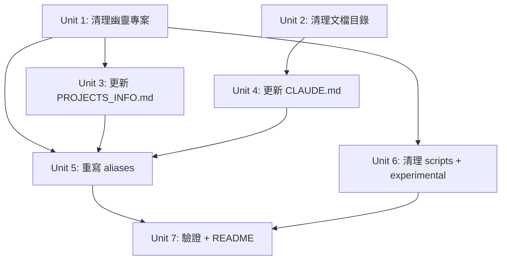

# refactor: YD 2026 工作區全面重構

## Overview

YD 2026 工作區經過 Phase 1-4 重構後仍存在結構性問題：幽靈專案（P1/P2/P3 空目錄）、根目錄 git 身份混亂、文檔膨脹、腳本混雜。本計劃一次性清理所有問題，重建乾淨的工作區結構。

## Problem Frame

工作區當前有 4 類問題：
1. **幽靈專案**：P1/P2/P3 是空目錄，但 PROJECTS_INFO.md、CLAUDE.md、aliases 到處引用它們
2. **Git 身份混亂**：根目錄 remote 是 `session-wrap-skill.git`，NS_0327/remotion-clip/session-wrap-backend 被錯誤地追蹤在根 git 中
3. **文檔膨脹**：`docs/` 有 37+ 文件，大部分是 session-wrap 產品文檔而非工作區文檔
4. **配置漂移**：aliases、CLAUDE.md、PROJECTS_INFO.md 引用不存在的路徑和專案

## Requirements Trace

- R1. 刪除所有幽靈專案引用（空目錄 + 文檔 + aliases）
- R2. 清理文檔目錄，只保留工作區相關文件
- R3. 更新 PROJECTS_INFO.md 反映真實專案狀態
- R4. 更新 CLAUDE.md 反映真實目錄結構
- R5. 重寫 .zshrc-workspace 移除失效別名，更新有效別名
- R6. 清理 scripts/ 目錄，移除廢棄腳本
- R7. 清理根目錄廢棄的 experimental 項目（0323、APP、sub2api-deploy）
- R8. 驗證 hook 路徑不受影響（過往教訓）

## Scope Boundaries

- 不改變有獨立 .git 的專案內部結構（gwx、claude_code_telegram_bot、ctx、clausidian、session-wrap-skill）
- 不解決根 git 的身份問題（session-wrap-skill remote）—— 這需要單獨的 git 遷移計劃
- 不觸碰 obsidian/ 知識庫
- 不觸碰 ~/.claude/settings.json 中的 hook 配置（除非路徑被本次重構破壞）

## Context & Research

### Relevant Code and Patterns

- Phase 1-4 重構歷史記錄在 memory 文件中（workspace_structure_phase2-4.md）
- 2026-03-27 workspace cleanup session 的教訓：hook 路徑會因目錄遷移而壞掉
- ChillVibe SDD 框架被 gwx 和 NS_0327 共用

### Institutional Learnings

- **Hook 路徑破損**：目錄重構最常見的 breakage 是 `settings.json` 中的 hook 路徑硬編碼了舊路徑。任何重構都必須檢查 settings.json
- **避免過度文檔化**：Phase 3 建了 974 行 DEVELOPMENT.md，Phase 4 又砍到 24 行。保持精簡
- **驗證清單**：重構後必須 `source ~/.zshrc-workspace` 測試所有別名，測試 `yd-status`，驗證 git 操作

## Key Technical Decisions

- **P1/P2/P3 處理方式**：直接刪除空目錄，移除所有引用。理由：用戶確認已廢棄，保留空目錄只會繼續造成混亂
- **文檔策略**：session-wrap 產品文檔移到 `docs/archive/session-wrap/`，工作區級文檔保留在 `docs/`。理由：這些文檔是根 git 歷史的一部分，歸檔比刪除安全
- **廢棄實驗項目**：0323、APP 移到 Archived/，sub2api-deploy 的 docker 數據直接刪除。理由：0323/APP 是空 stub，sub2api-deploy 只有 postgres/redis 數據目錄
- **根目錄符號連結**：移除 `NS_0327` symlink。理由：根目錄不應有項目快捷方式，用 alias 即可
- **專案編號重整**：P1=gwx, P2=TG Bot, P3=NS_0327（按活躍度排序）。理由：反映真實使用頻率

## Open Questions

### Resolved During Planning

- P1/P2/P3 是否在其他位置？→ 用戶確認已廢棄
- remotion-clip 是否還需要？→ 經查 remotion-clip 已不存在於 experimental/。dspy-trial 存在但未在計劃中提及 — 需決定處置方式

### Deferred to Implementation

- 根 git remote 是否需要改名？→ 需要單獨的 git 遷移計劃
- session-wrap-backend 是否應該有自己的 git repo？→ 超出本次範圍

## Implementation Units

- [ ] **Unit 1: 清理殘留引用 + git 追蹤狀態**

**Goal:** 確認文件系統刪除已完成，處理 git 追蹤狀態，清理 .gitignore

**Requirements:** R1, R7

**Dependencies:** None

**Note:** 文件系統刪除大部分已完成（dexapi/test-ydapi/watermark-0324/0323/APP/sub2api-deploy 目錄和 NS_0327 symlink 均已不存在）。本 unit 聚焦於 git 狀態清理。

**Files:**
- Verify deleted: `projects/production/dexapi/`, `test-ydapi/`, `watermark-0324/` (已不存在)
- Verify deleted: `projects/experimental/0323/`, `APP/`, `sub2api-deploy/` (已不存在)
- Verify deleted: `NS_0327` symlink (已不存在)
- Modify: `.gitignore` (移除不再需要的規則)
- Run: `git rm` 清理 git 追蹤中的已刪除文件（server/、web/、examples/ 等在 git status 中顯示為 deleted）

**Approach:**
- 確認所有目標目錄已不存在
- 用 `git rm` 正式從 git 追蹤中移除已刪除的文件
- 清理 .gitignore 中引用這些路徑的規則
- 決定 `projects/experimental/dspy-trial/` 的處置方式（保留、歸檔或忽略）

**Patterns to follow:**
- 2026-03-27 cleanup session 的做法

**Test expectation:** none -- git 狀態清理

**Verification:**
- `ls projects/production/` 只顯示 claude_code_telegram_bot 和 gwx
- `ls projects/experimental/` 只顯示 NS_0327 和 dspy-trial
- `git status` 中無大量 deleted 文件

---

- [ ] **Unit 2: 整理文檔目錄**

**Goal:** 將 session-wrap 產品文檔歸檔，保留工作區級文檔

**Requirements:** R2

**Dependencies:** None

**Files:**
- Create: `docs/archive/session-wrap/` (歸檔目錄)
- Move to archive (verify each exists first — most may already be archived): `docs/AGENT-WORKFLOW.md`, `docs/BENCHMARKS.md`, `docs/CONTRIBUTING.md`, `docs/DASHBOARD-DEPLOYMENT-GUIDE.md`, `docs/ENTERPRISE-ADOPTION.md`, `docs/FAQ-TROUBLESHOOTING.md`, `docs/INTEGRATIONS.md`, `docs/MIGRATION.md`, `docs/OPENSOURCE-COLLABORATION.md`, `docs/PRODUCTION-SETUP.md`, `docs/QUICKSTART-EXAMPLES.md`, `docs/SECURITY.md`, `docs/SOLO-DEVELOPER.md`, `docs/STARTUP-TEAM-WORKFLOW.md`, `docs/TEAM-RITUALS.md`, `docs/TESTING.md`, `docs/VISUALIZATION-GUIDE.md`
- Keep in docs/: `docs/ARCHITECTURE.md`, `docs/CHANGELOG.md`, `docs/CI-CD.md`, `docs/WORKSPACE_STRUCTURE.md`

**Approach:**
- Session-wrap 產品文檔（workflow guides、setup guides、enterprise docs）全部歸檔到 `docs/archive/session-wrap/`
- 保留與工作區結構直接相關的文檔
- `docs/archive/` 中已有的舊文檔保持不動

**Patterns to follow:**
- 2026-03-27 cleanup 已建立 `docs/archive/` 模式

**Test expectation:** none -- 純文件移動

**Verification:**
- `docs/` 頂層只剩 4-6 個文件 + `archive/` + `plans/`
- 歸檔文件在 `docs/archive/session-wrap/` 中完整存在

---

- [ ] **Unit 3: 重寫 PROJECTS_INFO.md**

**Goal:** 反映真實專案狀態，移除所有幽靈專案引用

**Requirements:** R3

**Dependencies:** Unit 1

**Files:**
- Modify: `PROJECTS_INFO.md`

**Approach:**
- 完全重寫專案表格：P1=gwx (Go CLI), P2=TG Bot (Node.js automation), P3=NS_0327 (Python HR Bot)
- 更新路徑、技術棧、狀態信息
- 更新 tools 項目信息（ctx、clausidian、session-wrap-skill、session-wrap-backend）
- 移除所有 dexapi、test-ydapi、watermark-0324 引用
- 保持簡潔，不過度文檔化

**Patterns to follow:**
- 當前 PROJECTS_INFO.md 的表格格式，但更新內容

**Test scenarios:**
- Happy path: 文件中所有路徑都指向存在的目錄
- Edge case: 確認沒有殘留的 P1/P2/P3 舊引用（grep "dexapi\|test-ydapi\|watermark" PROJECTS_INFO.md 應返回空）

**Verification:**
- 文件中每個路徑都可以 `ls` 成功
- 無 dexapi/test-ydapi/watermark 引用

---

- [x] **Unit 4: 更新 CLAUDE.md** *(已由用戶完成)*

**Goal:** 反映真實目錄結構和專案配置

**Requirements:** R4

**Dependencies:** Unit 2

**Note:** CLAUDE.md 已被更新為新結構（P1=GWX, P2=TG Bot, P3=NS_0327），此 unit 已完成。

**Files:**
- Modify: `CLAUDE.md`

**Approach:**
- 更新目錄結構圖，移除已刪除的目錄
- 更新 Projects 表格：P1=gwx, P2=TG Bot, P3=NS_0327
- 更新快速命令映射
- 保持 Phase 4 的精簡風格（24 行配置）

**Patterns to follow:**
- 當前 CLAUDE.md 的格式和風格
- Phase 4 的 context 優化原則：精簡 > 詳細

**Test scenarios:**
- Happy path: CLAUDE.md 中的每個路徑和命令都有效
- Edge case: 確認 Projects 表格中的路徑都存在

**Verification:**
- 目錄結構圖與 `ls` 輸出一致
- Projects 表格中的路徑全部存在

---

- [ ] **Unit 5: 重寫 .zshrc-workspace**

**Goal:** 移除失效別名，更新專案編號映射，確保所有命令可用

**Requirements:** R5

**Dependencies:** Unit 1, Unit 3, Unit 4

**Files:**
- Modify: `.zshrc-workspace`

**Approach:**
- 重新映射別名：`p1`=gwx, `p2`=claude_code_telegram_bot, `p3`=NS_0327 experimental
- 移除 dev1/dev2/dev3、test1/test2/test3、build1/build2/build3（這些是幽靈專案的命令）
- 更新 `yd-status()` 函數中的目錄列表
- 保留 `pw`、`pj`、`kb`、`mem` 通用別名
- 保留 `skill-deploy`、`skill-list`、`skill-status`、`skill-new` 工具別名
- 驗證 kb alias 路徑（當前指向 `.obsidian-vault`，確認是否正確）

**Patterns to follow:**
- 當前 `.zshrc-workspace` 的風格
- 別名命名慣例：短助記符

**Test scenarios:**
- Happy path: `source ~/.zshrc-workspace` 無報錯，每個 alias 指向存在的目錄
- Error path: `p1`/`p2`/`p3` 在 `source` 前不可用（不影響 shell 啟動）
- Integration: `yd-status` 函數遍歷的目錄全部存在且能顯示 git log

**Verification:**
- `source` 後無報錯
- `p1 && pwd` 輸出正確的 gwx 路徑
- `yd-status` 函數正常執行

---

- [ ] **Unit 6: 清理 scripts/ 和 experimental/**

**Goal:** 移除或歸檔廢棄的腳本

**Requirements:** R6

**Dependencies:** Unit 1

**Files:**
- Review: `scripts/` 目錄（含子目錄 agent/、deploy/、lib/、test/、viz/，共 ~29 個腳本）
- Potential moves to archive (使用完整路徑): `scripts/deploy/deploy-railway.sh`、`scripts/test/validate-demo.sh`、`scripts/test/integration-test.sh`、`scripts/viz/visualize-tasks.sh`、`scripts/test/test-agent-tools.sh`
- **MUST NOT MOVE** (有外部硬引用):
  - `scripts/agent/agent-trace.sh` — `~/.claude/settings.json` PostToolUse hook 引用（注意：settings.json 引用路徑是 `scripts/agent-trace.sh`，實際文件在 `scripts/agent/agent-trace.sh`，路徑不一致需修復）
  - `scripts/obsidian-daily.sh` — launchd `com.dex.obsidian-daily` 引用
  - `scripts/obsidian-monthly.sh` — launchd `com.dex.obsidian-monthly` 引用
  - `scripts/obsidian-weekly.sh` — launchd `com.dex.obsidian-weekly` 引用
  - TG Bot `obsidian-journal-sync.mjs` — `settings.json` npm-publish 和 git-push hooks 硬引用（路徑：`projects/production/claude_code_telegram_bot/obsidian-journal-sync.mjs`）
- Keep: 上述腳本 + session-wrap.sh、skill-deploy.sh、archive-old-sessions.sh、trace-*.sh、setup.sh

**Approach:**
- 先確認 4 個有外部硬引用的腳本絕不移動（settings.json hook + launchd cron）
- 將純 session-wrap 產品腳本移到 `scripts/archive/`
- 保留工作區管理和 agent 工具腳本

**Patterns to follow:**
- 先 grep 確認每個腳本是否被其他文件引用

**Test scenarios:**
- Happy path: 保留的腳本都能正常執行（dry-run 驗證）
- Integration: hook 引用的腳本路徑未被移動

**Verification:**
- `scripts/` 頂層只剩活躍使用的腳本
- `grep -r "scripts/" ~/.claude/settings.json` 確認 hook 路徑未受影響

---

- [ ] **Unit 7: 全面驗證 + 更新 README**

**Goal:** 驗證所有改動一致性，更新 README 反映新結構

**Requirements:** R8

**Dependencies:** Unit 5, Unit 6

**Files:**
- Modify: `README.md` (如需要)
- Check: `~/.claude/settings.json` (hook 路徑驗證)
- Check: `~/.claude/projects/-Users-dex-YD-2026/memory/MEMORY.md` (路徑引用)

**Approach:**
- 執行完整驗證清單：
  1. `source ~/.zshrc-workspace` — 無報錯
  2. 測試每個 alias（p1/p2/p3/pw/pj/mem）
  3. 測試 `yd-status` 函數
  4. `grep -r "dexapi\|test-ydapi\|watermark-0324" CLAUDE.md PROJECTS_INFO.md .zshrc-workspace` — 確認無殘留
  5. 檢查 `settings.json` 中的 hook 路徑是否仍指向有效文件
  6. 確認 `projects/production/README.md` 和 `projects/tools/README.md` 是否需要更新
- 更新 README.md 如有需要

**Patterns to follow:**
- 2026-03-27 cleanup 的驗證清單

**Test scenarios:**
- Happy path: 所有別名、函數、hook 正常運行
- Error path: 發現殘留引用 → 記錄並修復
- Integration: 開新 Claude Code session 測試 stop hook

**Verification:**
- 零殘留引用（grep 返回空）
- 所有 alias 和函數正常
- Hook 無報錯

## System-Wide Impact

- **Interaction graph:** `.zshrc-workspace` 被 shell 啟動載入；`settings.json` PostToolUse hook → `scripts/agent-trace.sh`（注意：實際文件在 `scripts/agent/agent-trace.sh`，路徑不一致）；`settings.json` npm-publish + git-push hooks → `projects/production/claude_code_telegram_bot/obsidian-journal-sync.mjs`；`settings.json` Stop hook + vault-sync → `obsidian/` 和 `projects/`；3 個 launchd cron → `scripts/obsidian-{daily,weekly,monthly}.sh`；CLAUDE.md 被 Claude Code 每次會話載入；PROJECTS_INFO.md 被 `yd-info` 引用
- **Error propagation:** 路徑錯誤會導致 alias 失效（無害）或 hook 報錯（中斷工作流）
- **State lifecycle risks:** 無持久化數據風險，純文件系統操作
- **Unchanged invariants:** 有獨立 `.git` 的專案（gwx、claude_code_telegram_bot、ctx、clausidian、session-wrap-skill）內部結構不變；obsidian/ 知識庫不變；memory 文件不變

## Risks & Dependencies

| Risk | Mitigation |
|------|------------|
| Hook 路徑破損 | Unit 7 明確檢查 settings.json，在重構前備份 |
| agent-trace.sh 路徑不一致 | settings.json 引用 `scripts/agent-trace.sh` 但實際在 `scripts/agent/agent-trace.sh`，需修復 |
| TG Bot hook 硬引用 | `obsidian-journal-sync.mjs` 被 2 個 settings.json hooks 引用，不可移動 |
| Alias 遺漏 | Unit 5 + Unit 7 雙重驗證 |
| 文檔中殘留舊路徑 | Unit 7 用 grep 全面掃描 |
| 歸檔腳本被 cron 引用 | Unit 6 先 grep 確認再移動 |
| MEMORY.md 殘留引用 | project_dexapi.md、project_test_ydapi.md、project_watermark.md 仍在 Hot 區，需移至 Cold 或刪除 |

## Sources & References

- Memory: `workspace_structure_phase2.md` — Phase 2 項目分離
- Memory: `workspace_structure_phase3.md` — Phase 3 文檔層級化
- Memory: `workspace_structure_phase4.md` — Phase 4 context 優化
- Memory: `session_20260327_workspace_cleanup.md` — 上次清理經驗
- Memory: `optimization_phase4.md` — 精簡原則
