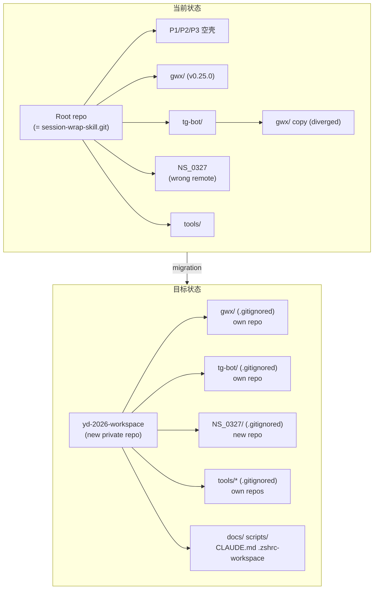
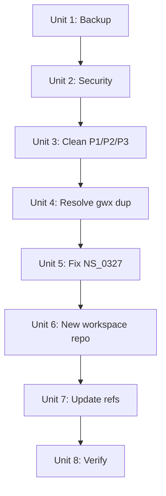

# refactor: YD 2026 Workspace Architecture Upgrade

## Overview

YD 2026 工作区存在多个严重架构问题：root repo 是 session-wrap-skill 的 npm 包 repo、三个空壳项目目录、gwx 双份 copy 已 diverge、NS_0327 remote 指错、secrets 已 commit 到 git history。本计划将 workspace 从混乱状态迁移到干净的独立 repo 架构。

## Problem Frame

工作区随时间有机增长，但 git 架构从未被刻意设计。核心问题是 workspace root 和 session-wrap-skill npm 包共享同一个 git repo，导致：
- `npm publish` 会发布 workspace 私有文件（CLAUDE.md, PROJECTS_INFO.md）
- 任何 workspace 管理 commit 都会污染 npm 包的 git history
- P1/P2/P3 空壳目录、gwx 重复、NS_0327 remote 错误等问题层层叠加
- GA4 service account key 文件存在但 `.gitignore` 写错了名字（`clausidian-` vs 实际 `openclaw-`），随时可能被误 commit
- tg-bot CLAUDE.md 中包含明文 PII（email、Chat ID、GCP Project ID）已 commit

## Requirements Trace

- R1. workspace repo 与 session-wrap-skill repo 完全分离
- R2. 删除 P1(dexapi)、P2(test-ydapi)、P3(watermark-0324) 空壳目录
- R3. 解决 gwx 双份 copy diverge 问题，只保留一份
- R4. 修复 NS_0327 git remote，指向独立 repo
- R5. 修复 tg-bot `.gitignore`（GA4 key 当前未被正确忽略）并加强 secrets 防护
- R6. 更新所有 alias、CLAUDE.md、memory、PROJECTS_INFO.md 与新架构一致
- R7. 建立全面的 .gitignore 规则防止 secrets 再次 commit（覆盖 GA4 key、credentials、PEM 等）
- R8. 新 workspace repo 推送到 GitHub private repo
- R9. `projects/tools/` 下所有有独立 repo 的子项目从 workspace tracking 中排除
- R10. 根 `package.json`（当前伪装为 session-wrap-skill）身份清理

## Scope Boundaries

- 不统一各项目的技术栈（Go/Node/Python 各自保持）
- 不建立 workspace 级 CI/CD（各项目保持独立 CI）
- 不改动各子项目的内部架构
- 不迁移 git submodule 方案（各项目保持独立 .git）
- session-wrap-skill npm 包的发布源问题暂不在此处理（需要单独评估 root 3.9.0 vs tools/ 3.1.0）

## Context & Research

### Relevant Code and Patterns

- Root `package.json`: name="session-wrap-skill", version=3.9.0, remote=session-wrap-skill.git
- `projects/production/gwx/` 最新 commit `64a2e05` (v0.25.0)
- `projects/production/claude_code_telegram_bot/gwx/` 最新 commit `740dc81`（已 diverge）
- `projects/experimental/NS_0327/` remote 错误指向 session-wrap-skill.git
- `.zshrc-workspace` 中 `p1/dev1` 等 alias 指向空目录
- GA4 key: `projects/production/claude_code_telegram_bot/openclaw-ga4-488308-*.json`（注意：`.gitignore` 写的是 `clausidian-*` 前缀，名称不匹配，key 实际未被忽略）
- tg-bot `config.mjs` 引用 gwx 路径：`GWX_PATH = resolve(process.env.HOME, 'go/bin/gwx')` — 使用编译后 binary，非本地源码
- `projects/tools/` 下 ctx、clausidian、session-wrap-skill、session-wrap-backend 全部被 workspace root 追踪（~300 文件）
- 根 `package.json` name="session-wrap-skill"，与 `projects/tools/session-wrap-skill/package.json` (v3.1.0) 身份冲突
- tg-bot `hooks-config.json` 包含 Telegram Bot Token 明文（已 gitignored，未 commit）
- `projects/experimental/remotion-clip/signals_cache/` 和 `sub2api-deploy/redis_data/dump.rdb` 等二进制/缓存被追踪

### Institutional Learnings

- Phase 2 经验：项目路径变更是唯一的 breaking change，需系统性更新 shell alias、hook 路径、硬编码引用
- 03-27 整理经验：hook 路径（settings.json）容易遗漏，需跟随项目迁移更新
- session-wrap 迁移经验：渐进式、向后兼容的迁移比大爆炸式升级效果好

## Key Technical Decisions

- **各子项目保持独立 .git，不用 submodule**: workspace 的 .gitignore 排除子项目目录。理由：submodule 增加日常操作复杂度，对 solo developer 来说得不偿失。各项目已经有独立的 GitHub repo 和 CI。
- **gwx 保留 `projects/production/gwx/`，删除 tg-bot 内的 copy**: tg-bot 内的 gwx 是手动 copy（两份 .git config 不同），主 gwx 版本更新（v0.25.0 vs tg-bot 内过时版本）。已验证 tg-bot 通过 `~/go/bin/gwx` binary 调用 gwx，不依赖本地源码。
- **根 `package.json` 删除或重写**: 当前 name="session-wrap-skill" 是身份冲突。新 workspace 不需要作为 npm 包发布，删除此文件或改名为 `yd-2026-workspace`。`.npmignore` 也应删除。
- **不需要 git filter-repo（对 GA4 key）**: GA4 key 从未被 commit — 但原因是从未被手动 `git add`，而非 `.gitignore` 保护（当前 `.gitignore` 写错了前缀，实际未生效）。这意味着 key 当前处于无保护状态，Unit 2 的 .gitignore 修复是阻塞性安全修复，必须在任何涉及 `git add` 的操作之前完成。
- **先备份再操作**: 每个 destructive step 前确认 backup 存在。
- **一次性完成迁移**: 中间状态不需要保持可用。预留 1-2 小时集中执行。

## Open Questions

### Resolved During Planning

- P1/P2/P3 如何处理 → 已确认：直接删除（已废弃）
- Workspace repo 策略 → 已确认：建新 GitHub private repo
- 嵌套 git 管理策略 → 决定用 .gitignore 排除子项目目录，不用 submodule

### Resolved by Deepening

- GA4 key 是否需要 git filter-repo → 不需要，key 从未被 commit（.gitignore 名称虽错，但文件也从未 git add）
- tg-bot 是否 import gwx 本地代码 → 已验证不是，`config.mjs` 用 `~/go/bin/gwx` binary
- `projects/tools/` 子项目是否被追踪 → 是，约 300 文件，必须在新 repo 的 .gitignore 中排除

### Deferred to Implementation

- tg-bot 内的 gwx copy 是否有独有 commit 需要 cherry-pick → 删除前需 diff 确认
- GA4 service account key 是否已在 GCP console 被轮换 → 执行时需用户确认
- session-wrap-skill npm 包的 version 延续性（root 3.9.0 vs tools/ 3.1.0）→ 独立 session 处理
- tg-bot CLAUDE.md 中的 PII 是否需要脱敏 → 属于 tg-bot repo 的安全加固，可独立处理

## High-Level Technical Design

> *This illustrates the intended approach and is directional guidance for review, not implementation specification. The implementing agent should treat it as context, not code to reproduce.*

## Implementation Units

- [ ] **Unit 1: Full Backup**

**Goal:** 创建完整备份，确保所有后续操作可回滚

**Requirements:** 所有 units 的前置条件

**Dependencies:** None

**Files:**
- 无文件变更，只创建备份

**Approach:**
- tar 打包整个 YD 2026 目录（排除 node_modules、.venv、obsidian/）
- 额外备份 `~/.claude/settings.json` 和 `~/.claude/projects/-Users-dex-YD-2026/memory/`（Unit 7 会修改这些文件）
- 验证备份完整性

**Test expectation: none -- 备份操作，无行为变更**

**Verification:**
- 备份文件存在且大小合理
- tar 列出内容确认关键文件在内

---

- [ ] **Unit 2: Security — 修复 .gitignore 并加强 Secrets 防护**

**Goal:** 修正 tg-bot `.gitignore` 中错误的文件名，添加全面的 secrets 防护规则

**Requirements:** R5, R7

**Dependencies:** Unit 1

**Files:**
- Modify: `projects/production/claude_code_telegram_bot/.gitignore`

**Approach:**
- 修正 `.gitignore` 中 `clausidian-ga4-488308-b099b607405b.json` → 改为通用 pattern `*-ga4-*.json`
- 追加全面的 secrets 防护规则：
  - `*-ga4-*.json`（GA4 service account keys）
  - `*service-account*.json` / `*credentials*.json`（GCP credentials）
  - `*.pem` / `*.key` / `*.p12`（私钥）
  - `hooks-config.json`（已有，确认存在）
  - `gwx-oauth-credentials.json`（OAuth client_secret，已有 gitignore 条目但仅为精确文件名）
- 确认 `gwx-oauth-credentials.json` 被 `*credentials*.json` pattern 覆盖
- 不需要 `git filter-repo` — 安全审查确认 GA4 key 从未被 commit
- 不需要 force push
- 用户需在 GCP console 确认 GA4 key 是否已轮换

**Patterns to follow:**
- tg-bot 已有 `.gitignore`，在现有基础上追加规则

**Test scenarios:**
- Happy path: `git check-ignore openclaw-ga4-488308-b099b607405b.json` 返回匹配
- Edge case: 验证 `*-ga4-*.json` pattern 不会误忽略合法的 JSON 文件
- Error path: `git check-ignore` 未匹配 → 检查 `.gitignore` 语法

**Verification:**
- `cd projects/production/claude_code_telegram_bot && git check-ignore openclaw-ga4-488308-b099b607405b.json` 返回匹配
- 已识别的每个 secret 文件（GA4 key、hooks-config.json、gwx-oauth-credentials.json）均被 `git check-ignore` 匹配
- `git status` 中 GA4 key 文件不显示为 untracked

---

- [ ] **Unit 3: 删除 P1/P2/P3 空壳目录**

**Goal:** 清除三个已废弃的空壳项目目录

**Requirements:** R2

**Dependencies:** Unit 1

**Files:**
- Delete: `projects/production/dexapi/`
- Delete: `projects/production/test-ydapi/`
- Delete: `projects/production/watermark-0324/`

**Approach:**
- 这三个目录是 workspace root git 的子目录（不是独立 repo），直接 `rm -rf`
- 不需要 git rm 因为它们是 untracked 或空

**Test expectation: none -- 删除空目录，无行为变更**

**Verification:**
- 三个目录不存在
- `ls projects/production/` 只显示 `gwx/` 和 `claude_code_telegram_bot/`

---

- [ ] **Unit 4: 解决 gwx 重复问题**

**Goal:** 删除 tg-bot 内的 gwx copy，只保留 `projects/production/gwx/`

**Requirements:** R3

**Dependencies:** Unit 1

**Files:**
- Delete: `projects/production/claude_code_telegram_bot/gwx/`
- Possibly modify: tg-bot 中引用 gwx 本地路径的脚本

**Approach:**
- 先 diff 两份 gwx 的 commit history，确认 tg-bot 内的 copy 没有独有的未推送 commit
- 如果有独有 commit，cherry-pick 到主 gwx repo
- grep tg-bot 代码确认是否有 `import` 或 `require` 引用 `./gwx/` 本地路径
- 如果有本地引用，改为使用 `gwx` CLI 命令或删除相关功能
- 删除 `claude_code_telegram_bot/gwx/` 整个目录

**Test scenarios:**
- Happy path: 删除后 tg-bot 的核心脚本（launchd 任务）仍能正常运行
- Edge case: tg-bot 脚本中 `import` 了 gwx 本地模块 → 需改为 CLI 调用
- Integration: tg-bot 的 gwx 相关功能（Google Workspace 操作）通过 `gwx` CLI 仍可用

**Verification:**
- `projects/production/claude_code_telegram_bot/gwx/` 不存在
- `grep -r 'gwx' projects/production/claude_code_telegram_bot/*.mjs` 中没有本地路径引用
- gwx CLI (`which gwx`) 可用

---

- [ ] **Unit 5: 初始化 NS_0327 独立 Git Repo**

**Goal:** NS_0327 从 workspace root 追踪中分离，拥有独立 git repo 和 GitHub remote

**Requirements:** R4

**Dependencies:** Unit 1

**Files:**
- Create: `projects/experimental/NS_0327/.git/`（通过 git init）
- 注意：NS_0327 当前没有独立 .git，其文件被 workspace root repo 追踪

**Approach:**
- **关键事实：NS_0327 没有独立 .git 目录** — 它是 workspace root git 的子目录
- 在 GitHub 创建新 private repo（如 `hr-admin-bots` 或 `ns0327`），**必须是 private**
- `cd projects/experimental/NS_0327 && git init`
- `git add . && git commit -m "initial: NS_0327 HR Admin Bot"`
- `git remote add origin <new-repo-url>`
- `git push -u origin main`
- 推送前审计 `.mcp.json` 和 `.agents/` 配置文件，确认无嵌入式凭证
- 回到 workspace root，`git rm -r --cached projects/experimental/NS_0327`（从 root 追踪中移除）

**Test scenarios:**
- Happy path: `cd NS_0327 && git remote -v` 显示新 private repo URL，`git push` 成功
- Edge case: `.mcp.json` 可能包含 API endpoint 或 token → push 前审计
- Error path: GitHub repo 创建失败 → 手动创建后重试

**Verification:**
- `cd projects/experimental/NS_0327 && git remote -v` 显示新 repo
- GitHub 上新 repo 有完整代码
- `git log` 显示 initial commit

---

- [ ] **Unit 6: 建立新 Workspace Repo**

**Goal:** workspace 拥有独立的 git repo，与 session-wrap-skill 完全分离

**Requirements:** R1, R8

**Dependencies:** Unit 2, 3, 4, 5

**Files:**
- Modify: root `.git/config`（重新初始化）
- Create: root `.gitignore`（排除子项目 + secrets）
- Delete: root `package.json`（session-wrap-skill 身份）
- Delete: root `.npmignore`（不再从 workspace 发布 npm）
- Tracked files: `CLAUDE.md`, `PROJECTS_INFO.md`, `.zshrc-workspace`, `docs/`, `scripts/`

**Approach:**
- **前置条件：确认 root repo 所有变更已 commit 或已处理**（`git status --porcelain` 检查）
- 先创建 `.gitignore` 文件（在删除 .git 之前写好，防止子项目文件在 git init 后被误 stage）
- 备份现有 `.git/` 目录
- `rm -rf .git` 删除旧的 session-wrap-skill git history
- 删除 root `package.json`（name="session-wrap-skill" 是身份冲突）和 `.npmignore`
- `git init` 创建全新 workspace repo（.gitignore 已就绪，确保子项目不被 stage）
- `.gitignore` 排除规则：
  - **独立 repo 子项目：**
    - `projects/production/gwx/`
    - `projects/production/claude_code_telegram_bot/`
    - `projects/experimental/NS_0327/`
    - `projects/experimental/remotion-clip/`
    - `projects/experimental/sub2api-deploy/`
    - `projects/tools/ctx/`
    - `projects/tools/clausidian/`
    - `projects/tools/session-wrap-skill/`
    - `projects/tools/session-wrap-backend/`（注意：无独立 .git — 决定保留在 workspace 追踪中，或先 git init 再排除。默认：保留在 workspace 追踪，从此列表移除）
    - `projects/tools/clausidian/`（如存在）
  - **数据/缓存：**
    - `obsidian/`, `Archived/`, `NS_0327/`（根目录残留）
    - `node_modules/`, `.venv/`, `*.pyc`, `__pycache__/`
    - `dump.rdb`, `*.wav`, `signals_cache/`
  - **Secrets catch-all：**
    - `*.env`, `**/*-ga4-*.json`, `**/*service-account*.json`
    - `**/*credentials*.json`, `**/*secret*`
    - `*.pem`, `*.key`, `*.p12`
    - `**/hooks-config.json`
- 在 GitHub 创建 `yd-2026-workspace` private repo
- `git remote add origin <new-repo-url>`
- 初始 commit 包含 workspace 管理文件

**Test scenarios:**
- Happy path: `git status` 干净，`git remote -v` 显示新 repo，`git push` 成功
- Edge case: 确认删除 root `package.json` 不影响任何子项目（各子项目有独立 package.json）
- Integration: `.gitignore` 正确排除所有子项目和 secrets，`git status` 不显示子项目文件
- Edge case: `projects/tools/session-wrap-backend/` 没有独立 `.git` — 确认是否需要先 `git init` 或保留在 workspace 追踪中

**Verification:**
- `git remote -v` 显示 `yd-2026-workspace`
- `git log` 只有 workspace 管理 commit
- `git status` 干净，子项目文件不出现
- GitHub 上 repo 内容正确

---

- [ ] **Unit 7: 更新所有引用**

**Goal:** alias、文档、memory 与新架构一致

**Requirements:** R6

**Dependencies:** Unit 6

**Files:**
- Modify: `.zshrc-workspace`
- Modify: `CLAUDE.md`
- Modify: `PROJECTS_INFO.md`
- Modify: `~/.claude/projects/-Users-dex-YD-2026/memory/MEMORY.md`
- Modify: `~/.claude/projects/-Users-dex-YD-2026/memory/project_dexapi.md` → 删除或标记废弃
- Modify: `~/.claude/projects/-Users-dex-YD-2026/memory/project_test_ydapi.md` → 删除或标记废弃
- Modify: `~/.claude/projects/-Users-dex-YD-2026/memory/project_watermark.md` → 删除或标记废弃
- Modify: `~/.claude/settings.json`（如有 hook 路径引用旧项目）

**Approach:**
- `.zshrc-workspace`: 删除 `p1/dev1/test1/build1`（旧 dexapi）等指向空目录的 alias，更新 `p1` 指向 gwx、`p2` 指向 tg-bot、`p3` 指向 NS_0327（与已更新的 CLAUDE.md 一致）
- `PROJECTS_INFO.md`: 重写项目表格，移除 P1/P2/P3 旧项目，加入 gwx/tg-bot/NS_0327
- Memory 文件：删除 `project_dexapi.md`、`project_test_ydapi.md`、`project_watermark.md`（已废弃），更新 MEMORY.md 索引
- `settings.json`: grep 检查是否有 hook 路径引用 `dexapi`、`test-ydapi`、`watermark-0324`

**Test scenarios:**
- Happy path: `source ~/.zshrc-workspace && p1 && pwd` 输出 gwx 路径
- Edge case: 某些 memory 文件可能被其他 session 引用 → 标记废弃而非删除，或删除后更新索引
- Integration: `yd-status` 命令仍然正常工作，显示正确的项目列表

**Verification:**
- 所有 `p1/p2/p3` alias 指向正确的活跃项目
- `yd-status` 正常运行
- 无文档引用已删除的空壳目录
- `grep -r 'dexapi\|test-ydapi\|watermark-0324' CLAUDE.md PROJECTS_INFO.md .zshrc-workspace` 无结果

---

- [ ] **Unit 8: 端到端验证**

**Goal:** 确认整个迁移成功，所有工作流正常

**Requirements:** 全部

**Dependencies:** Unit 7

**Files:**
- 无文件变更

**Approach:**
- 验证清单逐项检查

**Test scenarios:**
- Happy path: 所有验证项通过
  - `source ~/.zshrc-workspace` 无报错
  - `p1 && pwd` → gwx 路径
  - `p2 && pwd` → tg-bot 路径
  - `p3 && pwd` → NS_0327 路径
  - `pw && git remote -v` → yd-2026-workspace
  - `cd projects/production/gwx && git remote -v` → gwx.git
  - `cd projects/experimental/NS_0327 && git remote -v` → 新 repo
  - `yd-status` 正常显示
  - `git log --all -p -- '*openclaw*'` 在 tg-bot repo 无结果
- Edge case: launchd 定时任务路径是否受影响 → 检查 plist 文件中的路径
- Integration: Claude Code session 启动时 CLAUDE.md 正确加载

**Verification:**
- 上述所有检查项通过
- 可以在任意子项目内正常 `git status/commit/push`
- workspace root `git status` 干净

## System-Wide Impact

- **Interaction graph:** `.zshrc-workspace` alias → 项目目录路径（需全部更新）；`settings.json` hooks → 可能引用旧路径；launchd plist（20 个定时任务）→ 路径未变，但需确认；tg-bot `config.mjs` GWX_PATH → 指向 `~/go/bin/gwx`，不受影响
- **Error propagation:** 路径变更是 breaking change，任何硬编码的旧路径都会导致 command not found 或 cd 失败
- **State lifecycle risks:** 删除 `.git` 目录是不可逆操作，必须先 backup
- **API surface parity:** 不涉及
- **Integration coverage:** 需要验证 launchd 定时任务、Claude Code hooks、shell alias 全部工作
- **Unchanged invariants:** 各子项目内部的 git history、代码、CI 配置不变；launchd plist 路径不变（它们引用绝对路径到 tg-bot 目录，该目录不移动）
- **npm publish 影响:** 删除 root `package.json` 后，`npm publish` 在 workspace root 会失败。session-wrap-skill 的发布应从 `projects/tools/session-wrap-skill/` 独立进行

## Risks & Dependencies

| Risk | Mitigation |
|------|------------|
| 删除 .git 后发现遗漏了重要的 workspace-only commit | Unit 1 backup 包含完整 .git 目录 |
| tg-bot 内 gwx copy 有未推送的独有 commit | Unit 4 先 diff 确认再删除 |
| GA4 key 未被轮换，文件在磁盘上仍有风险 | Unit 2 要求用户在 GCP 确认/轮换 |
| 删除 root package.json 影响已安装的全局 npm link | 检查 `npm ls -g` 确认无 link |
| launchd 任务路径断裂 | plist 引用绝对路径，目录不移动，风险低；Unit 8 验证 |
| settings.json hook 路径引用旧项目 | Unit 7 显式 grep 检查 |
| projects/tools/session-wrap-backend 无独立 .git | 决定是否保留在 workspace 追踪或单独建 repo |

## Sources & References

- Memory: `workspace_structure_phase2.md` — Phase 2 项目分离经验
- Memory: `session_20260327_workspace_cleanup.md` — 03-27 大整理经验
- Memory: `optimization_phase4.md` — Context 优化经验
- Docs: `docs/ARCHITECTURE.md` — 当前架构记录
- Docs: `docs/MIGRATION.md` — session-wrap 迁移经验
