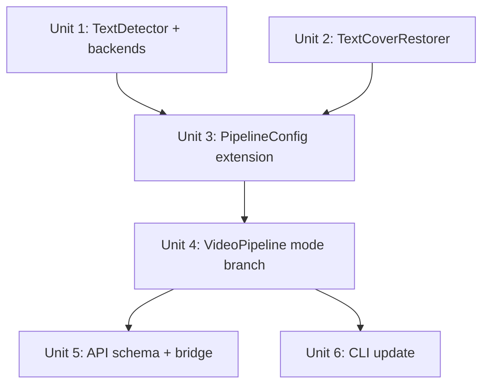

# feat: Add text-cover pipeline mode for floating text watermarks

## Overview

在現有 VWRS inpainting pipeline 之外，新增一條「文字遮蓋」pipeline mode（`text-cover`）。

核心差異：現有 pipeline 需要使用者手動提供 ROI 或 mask video；新模式會**自動偵測**影片中的文字水印位置，再用遮蓋（blur / block）取代修復，適合快速批次處理品質要求中等的場景。

## Problem Frame

浮動文字水印（半透明、可能漂移的版權字幕）是最常見的水印類型，但現有 pipeline 有兩個摩擦點：

1. 使用者需要先知道水印位置（ROI），或自備 mask video
2. 完整 inpainting（LaMa/ZITS）對「只需遮蓋」的用例過重

新 pipeline mode 目標：零前置操作、自動偵測、秒級批次處理。

## Requirements Trace

- R1. 使用者只需提供輸入影片，系統自動偵測文字水印並遮蓋輸出
- R2. 偵測後端可選（PaddleOCR / EasyOCR），允許速度/精度切換
- R3. 遮蓋策略可選（gaussian_blur / solid / lama），滿足不同品質需求
- R4. 新模式透過 `--pipeline-mode text-cover` CLI flag 啟用，不破壞現有 `watermark` 模式
- R5. API 同步支援新欄位（`pipeline_mode`, `text_detect_backend`, `cover_strategy`）
- R6. 每個 feature-bearing 模組有獨立測試，可用合成帶文字影格驗證

## Scope Boundaries

- **不包含** SAM2 精確多邊形 mask（保留為 future enhancement）
- **不包含** 原始 inpainting pipeline 的任何改動（tracking / temporal_ref / spatial_restore / integration）
- **不包含** 訓練或微調 OCR 模型
- **不包含** 即時（realtime）處理優化
- delogo ffmpeg 整合**僅作為靜態位置選項**，浮動水印使用 Python 路徑

## Context & Research

### Relevant Code and Patterns

- `src/pipeline.py` — `PipelineConfig` (dataclass) + `VideoPipeline.run()` 6-phase orchestrator
- `src/pipeline.py:_load_or_generate_masks()` — 新 text-cover 模式在此插入偵測邏輯
- `src/pipelines/spatial_restore.py` — `BaseRestorer` ABC + if/elif factory，新遮蓋策略跟隨此模式
- `src/pipelines/dl_inpainting.py` — `DLRestorationBackend` ABC，可選複用 LamaRestorer
- `api/schemas/pipeline.py` — `PipelineParams` Pydantic model，需新增欄位
- `api/services/pipeline_bridge.py` — `params_to_config()` 橋接函數，需傳遞新欄位
- `tests/` — pytest + 合成 frame pattern (`np.ones(...) * 100` + 手繪 mask)

### Institutional Learnings

- VWRS mask pipeline 視 mask 為黑盒：只要 `List[np.ndarray]` 格式正確，後續 phase 無需修改
- 任何新 backend 應從 ABC 繼承，保持 if/elif factory 風格（不引入 registry 框架）

### External References

- **PaddleOCR PP-OCRv5** — Mobile 模型 GPU 推理 6-11ms/幀，Python API: `PaddleOCR(use_gpu=True).ocr(frame)`，輸出多邊形 bbox
- **EasyOCR** — `reader.readtext(frame, batch_size=8)`，矩形 bbox，適合 CPU-only 或快速原型
- **RapidOCR** — PaddleOCR ONNX 版本，解決 PaddlePaddle + PyTorch CUDA 衝突問題
- **ffmpeg delogo** — `delogo=x=X:y=Y:w=W:h=H:band=4:show=0`，僅適合靜態固定位置

### Key Pitfall (from research)

- PaddleOCR + PyTorch（LaMa）共存可能有 CUDA 衝突 → 建議 `text-cover` 模式下先完成所有幀偵測，再釋放 OCR 模型
- OCR bbox 常略小於實際文字 → 所有 bbox 需 +4-8px padding
- 半透明水印 OCR 可能漏偵測 → 支援使用者手動設 `confidence_threshold`

## Key Technical Decisions

- **不新增新 pipeline class，但 text-cover 直接繞過 SpatialRestorer**：`_load_or_generate_masks()` 返回 mask 後，text-cover mode 應**直接呼叫 `TextCoverRestorer`**，不走 `SpatialRestorer` factory。原因：`SpatialRestorer.restore()` 的 reference-copy 三步邏輯（複製參考幀→識別剩餘區域→inpainting）對遮蓋策略毫無意義且有潛在副作用；`SpatialRestorer` 介面要求 `references` 參數，text-cover 模式下 temporal_ref phase 可能被跳過導致 `references` 為空
- **gaussian_blur / solid 路徑跳過 tracking + temporal_ref**：`_track_and_stabilize()` 和 `_fetch_temporal_references()` 對 gaussian_blur / solid 遮蓋策略無貢獻（OCR 已做時序採樣），計算浪費且 CSRT tracker 可能二次漂移 OCR 結果。`VideoPipeline.run()` 加入 mode guard：`text-cover + (gaussian_blur|solid)` 直接跳到 `_apply_cover(frames, masks)` phase
- **lama cover strategy 複用 LamaRestorer（單幀 loop）**：`LamaRestorer` 繼承 `DLRestorationBackend` 介面為 `restore_single(frame, mask)`，非多幀接口；Unit 4 需在 `_apply_cover()` 中自行包裝多幀 loop，不走 `DLSpatialRestorer` 包裝器
- **偵測間隔 + 線性插值**（非逐幀偵測）：每 N 幀偵測一次（預設 N=10），中間幀 bbox 線性插值。浮動水印漂移慢，插值誤差可接受
- **PaddleOCR 為 primary，EasyOCR 為 fallback**：PP-OCRv5 支援傾斜/旋轉文字；EasyOCR 作為 CPU-only 降級選項
- **Optional extra 依賴**：新依賴加入 `pyproject.toml` `[text-cover]` extra group，不影響現有 install

## Open Questions

### Resolved During Planning

- **Q: 新增獨立 pipeline class 還是 branch？** → 使用 branch，mask 格式相同，不需複製 pipeline 邏輯
- **Q: ffmpeg delogo 是否整合到 Python pipeline？** → 僅作為 CLI 的靜態遮蓋 shortcut（`--cover-strategy delogo` 直接調用 subprocess ffmpeg），不納入 Python frame-by-frame path
- **Q: CUDA 衝突如何處理？** → 文件說明 + 建議 RapidOCR (ONNX) 替代；程式碼不強制處理，由使用者環境決定

### Deferred to Implementation

- **PaddleOCR API 版本差異**：PP-OCRv5 的 Python API 調用細節需實際安裝確認（`use_angle_cls` 參數在新版可能已更名）
- **EasyOCR bbox 格式轉換**：EasyOCR 返回四點格式，轉換到 `(x, y, w, h)` 的邊界確認需實測
- **合成帶文字影格的最佳 OCR 偵測閾值**：實際合成測試後再定 `ocr_confidence_threshold` 預設值（初始建議 0.5）
- **`SpatialRestorer.__init__` 現有 bug**：`pipeline.py:219` 傳 `method=self.config.restoration_method` 給 `SpatialRestorer`，但後者不接受 `method` kwarg（只有 `backend + radius`）——這是現有 bug，text-cover 路徑繞過 `SpatialRestorer`，不引入也不修復此 bug
- **`_apply_cover()` 中 lama 路徑的 references 參數**：`LamaRestorer.restore_single(frame, mask)` 不需要 references；確認 `_apply_cover()` 在 lama 模式下不傳 references 即可

## High-Level Technical Design

> *此圖說明預計的解決方案架構，為方向性指引，非實作規範。實作時以此為背景，不需逐字複現。*

```
CLI / API
    │
    ▼
PipelineConfig
  ├── pipeline_mode: "text-cover"
  ├── text_detect_backend: "paddleocr" | "easyocr"
  ├── cover_strategy: "gaussian_blur" | "solid" | "lama"
  ├── detect_interval: int (default=10)
  ├── bbox_padding: int (default=6)
  └── confidence_threshold: float (default=0.5)
    │
    ▼
VideoPipeline._load_or_generate_masks()
    │
    ├── [watermark mode] ── 現有邏輯（ROI / mask video）
    │
    └── [text-cover mode]
            │
            ▼
        TextDetector（新 ABC）
            ├── PaddleOCRDetector（primary）
            └── EasyOCRDetector（fallback）
                │
                ▼
            偵測採樣（每 detect_interval 幀）
            + bbox padding
            + 線性插值（中間幀）
                │
                ▼
            List[np.ndarray] masks（與現有格式相同）
                │
    ▼ （masks 格式相同，以下複用現有邏輯）
    │
    ├── [cover_strategy == gaussian_blur / solid]
    │       → TextCoverRestorer（取代 SpatialRestorer）
    │         在 _spatial_restoration() phase 執行
    │
    └── [cover_strategy == lama]
            → 複用現有 LamaRestorer
```

## Implementation Units

### 依賴順序



---

- [ ] **Unit 1: TextDetector ABC + PaddleOCR / EasyOCR 後端**

**Goal:** 實作文字偵測抽象層，提供兩個具體後端，輸出統一格式 bbox list

**Requirements:** R1, R2, R6

**Dependencies:** None

**Files:**
- Create: `src/pipelines/text_detect.py`
- Test: `tests/test_text_detect.py`

**Approach:**
- 定義 `TextDetector` ABC，核心方法 `detect(frame: np.ndarray) -> List[Tuple[int,int,int,int]]`，返回 `[(x, y, w, h)]`
- `PaddleOCRDetector(TextDetector)` — 懶加載 `PaddleOCR` 實例（避免 import 時初始化），只在 `confidence >= threshold` 時保留結果，多邊形 bbox 用 `cv2.boundingRect()` 轉矩形，並加 `bbox_padding`
- `EasyOCRDetector(TextDetector)` — 四點轉矩形相同邏輯，`batch_size` 作為初始化參數
- 工廠函數 `create_detector(backend: str, **kwargs) -> TextDetector`
- 偵測採樣邏輯與插值（`detect_interval`）放在 `TextDetectionSampler` helper class：`sample_all_frames(frames) -> List[List[Tuple]]`

**Execution note:** 先寫失敗的單元測試，再實作。

**Patterns to follow:**
- `src/pipelines/spatial_restore.py` — ABC + factory 風格
- `src/pipelines/dl_inpainting.py` — 懶加載模型 pattern

**Test scenarios:**
- Happy path: 合成帶白色文字的 BGR frame（用 `cv2.putText`）送入 `EasyOCRDetector`，回傳非空 bbox list，bbox 涵蓋文字區域
- Happy path: `TextDetectionSampler` 對 30 幀序列（每 10 幀一個新 bbox），插值後所有 30 幀都有非空 bbox
- Edge case: 純黑 frame（無文字）→ 返回空 list，不拋例外
- Edge case: `confidence_threshold=1.0`（極高閾值）→ 可能返回空 list，不拋例外
- Edge case: bbox_padding 使 bbox 超出 frame 邊界 → 自動 clamp 到 frame 尺寸
- Error path: OCR 後端未安裝（ImportError）→ `create_detector` 拋 `RuntimeError` 並附明確提示訊息

**Verification:**
- `pytest tests/test_text_detect.py` 全部通過
- `EasyOCRDetector` 不需要 GPU 即可在 CI 通過

---

- [ ] **Unit 2: TextCoverRestorer（遮蓋策略）**

**Goal:** 實作遮蓋 restorer，支援 gaussian_blur 和 solid 策略，遵循現有 `BaseRestorer` 介面

**Requirements:** R3, R6

**Dependencies:** None（可並行於 Unit 1）

**Files:**
- Modify: `src/pipelines/spatial_restore.py`（新增 `TextCoverRestorer` class + factory if/elif）
- Test: `tests/test_text_cover_restorer.py`

**Approach:**
- `TextCoverRestorer(BaseRestorer)`，接受 `cover_strategy: str`（"gaussian_blur" | "solid"）和 `blur_ksize: int`（預設 51，必須為奇數）
- `gaussian_blur`：對每個 mask 非零區域取 ROI，套用 `cv2.GaussianBlur`
- `solid`：對 mask 非零區域填充指定 BGR color（預設純黑 `(0,0,0)`）
- 在 `SpatialRestorer.__init__` 的 if/elif factory 加入 `"text-cover"` backend → 創建 `TextCoverRestorer`
- `lama` strategy 在 Unit 4 透過直接呼叫 `LamaRestorer` 實現，不在此處處理

**Patterns to follow:**
- `src/pipelines/spatial_restore.py:TeleaRestorer` — 同介面

**Test scenarios:**
- Happy path: 帶矩形 mask 的 frame + gaussian_blur → mask 區域已被模糊，非 mask 區域像素不變
- Happy path: solid strategy → mask 區域像素值等於指定顏色
- Edge case: 空 mask（全零）→ frame 不變
- Edge case: mask 覆蓋整個 frame → 整幀模糊/填色，不拋例外
- Edge case: `blur_ksize=53`（奇數）→ 正常；`blur_ksize=52`（偶數）→ 自動調整為 53 或拋 ValueError（選其一並文件化）

**Verification:**
- `pytest tests/test_text_cover_restorer.py` 全部通過
- `TextCoverRestorer` 通過 `BaseRestorer` ABC 合規性測試（如有）

---

- [ ] **Unit 3: PipelineConfig 新增 text-cover 欄位**

**Goal:** 在 `PipelineConfig` dataclass 加入新模式所需的配置欄位，有合理預設值

**Requirements:** R4

**Dependencies:** Unit 1, Unit 2（需先知道欄位名稱）

**Files:**
- Modify: `src/pipeline.py` — `PipelineConfig` dataclass

**Approach:**
新增以下 optional fields（均有預設值，不破壞現有程式碼）：
```
pipeline_mode: str = "watermark"          # "watermark" | "text-cover"
text_detect_backend: str = "easyocr"      # "paddleocr" | "easyocr"
cover_strategy: str = "gaussian_blur"     # "gaussian_blur" | "solid" | "lama"
detect_interval: int = 10                 # 偵測採樣間隔（幀數）
bbox_padding: int = 6                     # bbox 擴展像素
confidence_threshold: float = 0.5        # OCR 信心度閾值
blur_ksize: int = 51                      # gaussian blur 核大小
```

**Test scenarios:**
- Happy path: 現有 `PipelineConfig()` 無新參數 → 所有新欄位使用預設值，`pipeline_mode == "watermark"`
- Edge case: 直接從 dict 構建 config（測試 dataclass 向後相容性）

**Verification:**
- 現有所有 `PipelineConfig` 相關測試繼續通過（無 regression）

---

- [ ] **Unit 4: VideoPipeline 加入 text-cover mode branch**

**Goal:** 在 `_load_or_generate_masks()` 加入 text-cover 分支，以及在 `_spatial_restoration()` 根據 `cover_strategy` 選擇 restorer

**Requirements:** R1, R3

**Dependencies:** Unit 1, Unit 2, Unit 3

**Files:**
- Modify: `src/pipeline.py` — `VideoPipeline._load_or_generate_masks()` + `_spatial_restoration()`
- Test: `tests/test_pipeline_text_cover.py`

**Approach:**
- `_load_or_generate_masks()` 加 branch：`if self.config.pipeline_mode == "text-cover": masks = self._detect_text_regions(frames)`
- 新私有方法 `_detect_text_regions(frames) -> List[np.ndarray]`：初始化 `TextDetector`，呼叫 `TextDetectionSampler`，將 bbox list 轉為 mask ndarray
- `_spatial_restoration()` 加 condition：`cover_strategy == "lama"` 時用 `LamaRestorer`，否則用 `TextCoverRestorer`
- 其餘 4 個 phase（tracking / temporal_ref / integration / output）**不改動**

**Patterns to follow:**
- `src/pipeline.py:_load_or_generate_masks()` — 現有 ROI/mask_video if/elif 結構
- `src/pipeline.py` — 懶加載 `self._restorer`

**Test scenarios:**
- Happy path: 合成 3 幀帶文字影片（用 `cv2.putText`），`pipeline_mode="text-cover"`, `cover_strategy="gaussian_blur"` → pipeline run 成功，輸出影片帶文字區域被模糊
- Integration: `pipeline_mode="watermark"`（現有模式）在加入新 branch 後繼續正常執行 → regression test
- Error path: `pipeline_mode="text-cover"` 且 OCR 後端未安裝 → pipeline 在 `_detect_text_regions` 階段 fail fast 並拋有意義的錯誤，不等到後續 phase 才 crash
- Edge case: 偵測結果為空（影片無文字）→ masks 全零，pipeline 繼續執行，輸出影片與輸入相同

**Verification:**
- `pytest tests/test_pipeline_text_cover.py` 全部通過
- `pytest tests/` 無 regression（現有測試套件通過率不低於當前基準）

---

- [ ] **Unit 5: API schema + bridge 更新**

**Goal:** 讓 REST API 支援 `text-cover` 模式的三個新參數

**Requirements:** R5

**Dependencies:** Unit 3

**Files:**
- Modify: `api/schemas/pipeline.py` — `PipelineParams` 新增欄位
- Modify: `api/services/pipeline_bridge.py` — `params_to_config()` 傳遞新欄位
- Test: `tests_api/test_pipeline_schema.py`（如不存在則新建）

**Approach:**
- `PipelineParams` 加入：
  - `pipeline_mode: str = Field(default="watermark", pattern="^(watermark|text-cover)$")`
  - `text_detect_backend: str = Field(default="easyocr", pattern="^(paddleocr|easyocr)$")`
  - `cover_strategy: str = Field(default="gaussian_blur", pattern="^(gaussian_blur|solid|lama)$")`
  - `detect_interval: int = Field(default=10, ge=1, le=100)`
  - `bbox_padding: int = Field(default=6, ge=0, le=30)`
  - `confidence_threshold: float = Field(default=0.5, ge=0.0, le=1.0)`
- `params_to_config()` 透傳新欄位到 `PipelineConfig`（一對一映射，無額外邏輯）

**Test scenarios:**
- Happy path: `PipelineParams(pipeline_mode="text-cover", cover_strategy="gaussian_blur")` → Pydantic validation 通過
- Error path: `pipeline_mode="invalid"` → Pydantic `ValidationError`
- Error path: `detect_interval=0` → `ValidationError`（ge=1 constraint）
- Integration: `params_to_config(PipelineParams(pipeline_mode="text-cover"))` → 返回 `PipelineConfig` 且 `pipeline_mode == "text-cover"`

**Verification:**
- `pytest tests_api/` 無 regression
- OpenAPI schema（`/docs`）顯示新欄位及其 enum 值

---

- [ ] **Unit 6: CLI 更新**

**Goal:** 在 `vwrs.py` 的 `process` subcommand 加入 `--pipeline-mode` 等新 flag

**Requirements:** R4

**Dependencies:** Unit 3

**Files:**
- Modify: `src/vwrs.py` — `_add_process_args()` 函數

**Approach:**
- 加入 `--pipeline-mode choices=["watermark", "text-cover"] default="watermark"`
- 加入 `--text-detect-backend choices=["paddleocr", "easyocr"] default="easyocr"`
- 加入 `--cover-strategy choices=["gaussian_blur", "solid", "lama"] default="gaussian_blur"`
- 加入 `--detect-interval type=int default=10`
- 加入 `--bbox-padding type=int default=6`
- 更新 `epilog` 範例 docstring 加入 `text-cover` 使用範例
- 在 `main()` 的 `PipelineConfig` 構建處傳遞新 args

**Test scenarios:**
- Happy path: `python -m vwrs process --input x.mp4 --pipeline-mode text-cover --output y.mp4` → 解析成功
- Error path: `--pipeline-mode unknown` → argparse error，提示有效選項
- Test expectation: none for output format — CLI parsing can be verified via `parse_known_args` in unit test

**Verification:**
- `python -m vwrs process --help` 顯示新 flag 及說明

---

## System-Wide Impact

- **Interaction graph:** `VideoPipeline` 內部 phase 之間透過 `masks` list 通信，text-cover mode 只替換 mask 來源，不接觸 `tracking.py` / `temporal_ref.py` / `integration.py`
- **Error propagation:** OCR 後端載入失敗應在 `_detect_text_regions()` 即拋出，不延遲到 frame 處理中途；mask 格式錯誤應在 `_load_or_generate_masks()` 返回後做 shape assertion
- **State lifecycle risks:** `PaddleOCR` / `EasyOCR` 模型對象應在 `TextDetector.__init__` 懶加載，不持久化跨請求（API context），每次 job 創建新實例
- **API surface parity:** `PipelineParams` 的 `pipeline_mode` pattern 必須與 `PipelineConfig.pipeline_mode` 允許值保持同步（deferred 到 implementation，建議用共用 literal constant）
- **Integration coverage:** Unit 4 的 integration test 需驗證 text-cover → 遮蓋輸出的端到端 frame diff（而非僅驗證 pipeline 不 crash）
- **Unchanged invariants:** 現有 `pipeline_mode="watermark"` 路徑、所有 `PipelineConfig` 欄位預設值、`pipeline_bridge.params_to_config()` 的現有參數映射均不改動

## Risks & Dependencies

| Risk | Mitigation |
|------|------------|
| PaddleOCR + PyTorch CUDA 版本衝突 | 預設後端為 EasyOCR（無 PaddlePaddle 依賴）；文件明確說明 PaddleOCR 需獨立 conda env 或 RapidOCR (ONNX) |
| 半透明水印 OCR 漏偵測 | 暴露 `confidence_threshold` 給使用者調整；文件說明 CLAHE 前處理技巧（作為進階 FAQ） |
| `detect_interval` 插值誤差（水印快速漂移） | 預設 N=10 保守；使用者可設 `--detect-interval 1` 強制逐幀偵測 |
| EasyOCR 在無 GPU 機器上速度過慢 | 明確在 README 標注 EasyOCR CPU 適用影片 < 5min；建議 GPU 用 PaddleOCR |
| 新 `optional [text-cover]` extra 破壞現有 install | 新依賴放入 `pyproject.toml` optional extras，不加入 base requirements |

## Documentation / Operational Notes

- `requirements.txt` 或 `pyproject.toml` 新增 `[text-cover]` extra：`paddleocr>=2.8`, `easyocr>=1.7`
- README 新增 `text-cover` 使用範例段落，說明安裝、典型命令、與現有 mode 的差異
- API OpenAPI schema 自動更新（Pydantic + FastAPI 自動生成，無需手動維護）

## Sources & References

- Related code: `src/pipeline.py`, `src/pipelines/spatial_restore.py`, `src/pipelines/dl_inpainting.py`
- External: [PaddleOCR PP-OCRv5](https://github.com/PaddlePaddle/PaddleOCR), [EasyOCR](https://github.com/JaidedAI/EasyOCR)
- Related art: [YaoFANGUK/video-subtitle-remover](https://github.com/YaoFANGUK/video-subtitle-remover), [hjunior29/video-text-remover](https://github.com/hjunior29/video-text-remover)
- ffmpeg delogo filter: https://ffmpeg.org/ffmpeg-filters.html#delogo
