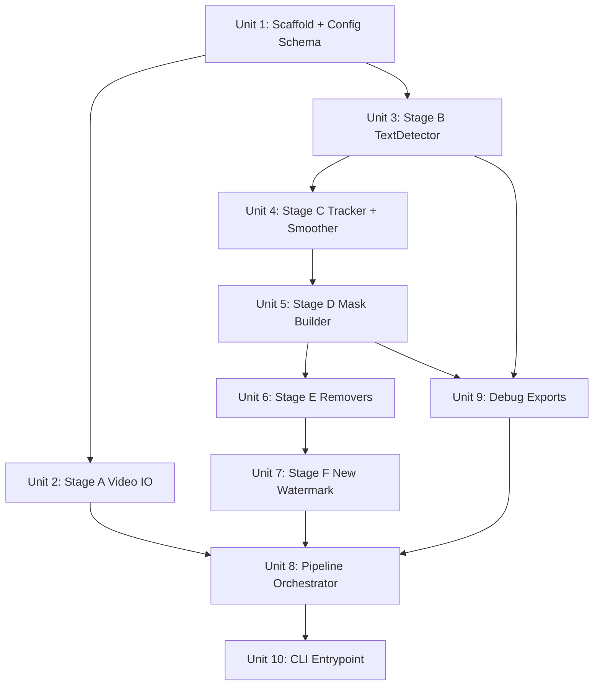

# feat: Dynamic Text Watermark Removal + New Watermark Overlay Tool

## Overview

在 `0331-1/` 目錄建立一個全新的**獨立本地工具**，用於：
1. 自動偵測影片中漂浮的文字浮水印
2. 對偵測區域生成穩定遮罩
3. 使用傳統 CV 方法去除（遮蓋/模糊/delogo）
4. 疊加使用者自訂的新浮水印

本專案**不是** VWRS 的延伸，也**不是**泛化視頻修復工具。架構從零開始設計，優先可調試、可交付、可快速迭代。

## Problem Frame

動態漂浮文字水印（版權字幕、頻道名稱、半透明品牌標記）的去除有三個核心摩擦點：

1. **位置不固定** — 不能用單一靜態 delogo 解決
2. **逐帧偵測會抖** — mask 需要時序平滑才能避免閃爍
3. **完美修復成本高** — 多數場景只需稳定遮蓋，不需 inpainting

目標：提供一條**可交付的工程路徑**：輸入 mp4 → 偵測 → 追蹤 → 遮蓋 → 新水印 → 輸出 mp4。

## Requirements Trace

- R1. 使用者只需提供輸入影片即可自動偵測並去除文字水印（零 ROI 前置操作）
- R2. 偵測後端可選（EasyOCR / PaddleOCR），允許速度/精度切換
- R3. 去除策略可選（gaussian_blur / solid / delogo），滿足不同品質需求
- R4. 支援疊加新浮水印（文字 or PNG）
- R5. 必須有可視化 debug 輸出（每個 stage 均可預覽）
- R6. 所有 Stage 透過統一 YAML config 驅動
- R7. CLI 支援 `--only-detect` / `--only-mask` / `--only-remove` 等分段執行
- R8. 每個 feature-bearing 模組有獨立測試

## Scope Boundaries

- **不包含** GUI（Tkinter / Web）
- **不包含** 實時處理（real-time pipeline）
- **不包含** LaMa / ZITS 等重型 inpainting（可作 future extension）
- **不包含** 批次多影片並行處理（MVP 只處理單支 mp4）
- **不包含** 訓練或微調 OCR 模型
- **不包含** SAM2 精確多邊形 mask

## Context & Research

### Relevant Code and Patterns

本專案是**全新專案**，`0331-1/` 目前只有 `AGENTS.md`、`CLAUDE.md`、`dev/`、`instincts/`，無任何現有代碼。

參考既有知識（VWRS 經驗 + 本 workspace 機構記憶）：
- Mask 格式統一為 `List[np.ndarray]`（uint8，0/255），下游複用時不需格式轉換
- OCR backend 應懶加載，不在 import 時初始化
- PaddleOCR + PyTorch 共存有 CUDA 衝突風險，MVP 預設 EasyOCR（無此問題）

### Institutional Learnings

- 新 backend/strategy 遵循 ABC + if/elif factory，避免過早引入 registry 框架
- `detect_interval`（採樣間隔 + 線性插值）是 OCR overhead 的實用緩解方案
- OCR bbox 通常略小於實際字元邊界，需 +4-8px padding

### External References

- **EasyOCR** — `reader.readtext(frame, batch_size=8)` 四點 bbox，CPU/GPU 均可，無依賴衝突，適合 MVP
- **PaddleOCR PP-OCRv5** — 支援傾斜/旋轉文字，GPU 6-11ms/幀，可選升級後端
- **ffmpeg delogo filter** — `delogo=x=X:y=Y:w=W:h=H:band=4:show=0`，靜態位置最快方案
- **ffmpeg drawtext / overlay** — 新水印疊加最輕量方案，不需 PIL
- **YaoFANGUK/video-subtitle-remover** — 開源參考實現，IoU tracking + inpaint 路線
- **OpenCV** — `cv2.GaussianBlur`, `cv2.VideoCapture`, `cv2.VideoWriter` 全程核心

## Key Technical Decisions

- **Stage-based pipeline，非 class hierarchy**：每個 Stage 是獨立 callable module，`run_pipeline.py` 依序調用。理由：降低耦合，任一 stage 可單獨替換或跳過，調試時直接跑單 stage
- **EasyOCR 作為 MVP 唯一後端**：無 PaddlePaddle 依賴，CPU 可用，四點 bbox 格式穩定。PaddleOCR 在 Unit 3 中保留 ABC，實作延後到迭代二
- **逐幀偵測 → 採樣插值**：預設每 `detect_interval=10` 幀偵測一次，中間幀線性插值 bbox。理由：EasyOCR CPU 約 100-300ms/幀，全幀處理 30fps 影片不可行
- **IoU + 中心距離雙重匹配做追蹤**：避免單純 IoU 在小 bbox 時失效，相鄰幀 bbox 匹配後做 EMA（指數加權平均）平滑，消除抖動
- **去除優先 gaussian_blur**：100x 快於 inpainting，對「合規遮蓋」場景已足夠；delogo 作為 CLI-only 靜態快捷；lama 作為未來選項預留介面
- **新水印後處理**：必須在去除舊水印**之後**疊加。MVP 用 ffmpeg subprocess 的 `drawtext` / `overlay` filter，避免引入新依賴
- **Config 以 Pydantic + YAML 雙層驗證**：YAML 加載後透過 Pydantic model 驗證，提供有意義的錯誤訊息，而不是 KeyError 在運行時爆炸
- **debug 輸出作為一等公民**：每個 Stage 接受可選的 `debug_dir` 參數，輸出視覺化結果。`--save-debug` flag 統一控制

## Open Questions

### Resolved During Planning

- **Q: 是否複用 VWRS 代碼？** → 否。0331-1 是全新獨立工具，架構不同，不繼承 VWRS
- **Q: ffmpeg delogo 納入 Python pipeline 還是 CLI shortcut？** → CLI subprocess shortcut，不納入 frame-by-frame Python 路徑（位置不固定的動態水印走 Python 路徑）
- **Q: 新水印用 PIL 還是 ffmpeg？** → ffmpeg drawtext/overlay，零新依賴，配置簡單
- **Q: 測試如何在無視頻文件下進行？** → 合成 frame（`np.ones(...)`+`cv2.putText`）作測試輸入，不依賴外部 fixture 影片

### Deferred to Implementation

- **EasyOCR 四點 bbox → (x,y,w,h) 邊界處理細節**：需實測確認 `[[x1,y1],[x2,y2],[x3,y3],[x4,y4]]` 的順序一致性
- **EMA 平滑係數 (alpha) 最佳預設值**：初始建議 0.5，實際調試後確認
- **detect_interval 預設值最終確認**：初始 10，實測 EasyOCR CPU 速度後可能調整
- **PaddleOCR backend 實作細節**：PP-OCRv5 Python API 在新版可能有參數變化，延後到迭代二確認

## High-Level Technical Design

> *此圖說明預計的解決方案架構，為方向性指引，非實作規範。*

```
CLI (python -m src.app)
        │
        ▼
 Config (YAML + Pydantic)
        │
        ▼
run_pipeline.py  ─────── PipelineConfig
        │
        ├─── Stage A: VideoReader
        │         └── frames: List[np.ndarray], metadata: VideoMeta
        │
        ├─── Stage B: TextDetector (EasyOCR/PaddleOCR)
        │         + CandidateFilter
        │         └── raw_detections: Dict[frame_idx, List[BBox]]
        │                            (BBox = namedtuple x,y,w,h,conf)
        │
        ├─── Stage C: WatermarkTracker + TemporalSmoother
        │         └── smoothed_tracks: List[Track]
        │                            (Track = List[BBox | None] per frame)
        │
        ├─── Stage D: MaskBuilder + MaskRender
        │         └── masks: List[np.ndarray]  (uint8 0/255, same HxW as frame)
        │
        ├─── Stage E: Remover (blur | solid | delogo)
        │         └── cleaned_frames: List[np.ndarray]
        │
        ├─── Stage F: WatermarkOverlay (text | image)
        │         └── final_frames: List[np.ndarray]
        │
        └─── VideoWriter → output.mp4

Debug path (--save-debug):
  Stage B → debug/detection_overlay.mp4
  Stage D → debug/mask_preview.mp4
  Stage E → debug/removed_preview.mp4
  Stage F → debug/final_preview.mp4
```

## Implementation Units



---

- [ ] **Unit 1: Project Scaffold + Config Schema**

**Goal:** 建立專案目錄結構、依賴管理、YAML config schema（Pydantic model）

**Requirements:** R6

**Dependencies:** None

**Files:**
- Create: `pyproject.toml` 或 `requirements.txt`
- Create: `src/__init__.py`, `src/config.py`
- Create: `configs/demo.yaml`
- Create: `tests/__init__.py`, `tests/conftest.py`
- Test: `tests/test_config.py`

**Approach:**
- `src/config.py` 定義 `PipelineConfig` Pydantic v2 model，包含所有子 section：
  - `InputConfig(path, start_sec, end_sec)`
  - `DetectionConfig(backend, detect_interval, bbox_padding, confidence_threshold, min_area, edge_region_only)`
  - `TrackingConfig(iou_threshold, center_dist_threshold, ema_alpha, gap_tolerance)`
  - `MaskConfig(expand_px, feather_radius)`
  - `RemoveConfig(strategy, blur_ksize, solid_color, delogo_band)`
  - `WatermarkConfig(enabled, type, text, image_path, position, opacity, scale, margin, start_sec, end_sec)`
  - `DebugConfig(enabled, output_dir)`
- `load_config(yaml_path: str) -> PipelineConfig` 工廠函數，YAML 讀取後 model_validate
- `configs/demo.yaml` 提供完整 key 示例，所有值為合理預設

**Patterns to follow:**
- Pydantic v2 `model_validator` 做跨欄位驗證（如 blur_ksize 必須為奇數）
- 所有 section 有預設值，只有 `input.path` 為必填

**Test scenarios:**
- Happy path: 讀取 `configs/demo.yaml` → `PipelineConfig` 實例化成功，各欄位值與 YAML 一致
- Happy path: `PipelineConfig()` 無參數 → 所有非必填欄位使用預設值
- Error path: `input.path` 缺失 → Pydantic ValidationError，錯誤訊息明確指向 `input.path`
- Error path: `remove.blur_ksize=52`（偶數）→ ValidationError
- Edge case: YAML 有未知欄位（typo）→ Pydantic `extra="ignore"` 忽略，不 crash

**Verification:**
- `pytest tests/test_config.py` 全部通過
- `python -c "from src.config import load_config; load_config('configs/demo.yaml')"` 無報錯

---

- [ ] **Unit 2: Stage A — Video Reader / Writer + FFmpeg Utils**

**Goal:** 實作影片讀取（metadata + frame extraction）、影片寫入、以及 ffmpeg subprocess 工具函數

**Requirements:** R1

**Dependencies:** Unit 1

**Files:**
- Create: `src/video/reader.py`
- Create: `src/video/writer.py`
- Create: `src/video/ffmpeg_utils.py`
- Test: `tests/test_video_io.py`

**Approach:**
- `VideoReader`：
  - `read_metadata(path) -> VideoMeta` — namedtuple: fps, width, height, frame_count, duration_sec
  - `iter_frames(path) -> Generator[np.ndarray, None, None]` — `cv2.VideoCapture` 逐幀 yield BGR frame
  - `read_frames(path, start_sec, end_sec) -> List[np.ndarray]` — 讀取指定時間段
- `VideoWriter`：
  - `write_frames(frames, path, fps, fourcc="mp4v")` — `cv2.VideoWriter` 寫出
  - 支援 `mp4v` (mp4)，不預設其他 codec
- `ffmpeg_utils.py`：
  - `add_watermark_text(input_path, output_path, wm_config: WatermarkConfig)` — subprocess ffmpeg drawtext
  - `add_watermark_image(input_path, output_path, wm_config: WatermarkConfig)` — subprocess ffmpeg overlay
  - `apply_delogo(input_path, output_path, x, y, w, h)` — subprocess ffmpeg delogo（靜態位置快捷）
  - 所有函數檢查 returncode，失敗時拋 `RuntimeError`
- `VideoMeta` namedtuple 定義在 `src/video/reader.py`

**Patterns to follow:**
- Generator 模式避免大影片全幀 OOM
- subprocess `check=True` + `capture_output=True`

**Test scenarios:**
- Happy path: 合成 10 幀 numpy array（`np.zeros((480, 640, 3), dtype=np.uint8)`）→ `write_frames` → 寫出 mp4 → `read_metadata` 讀取 → frame_count=10, width=640, height=480
- Happy path: `read_frames(path, start_sec=0, end_sec=None)` 讀取全部幀，幀數與 write 時一致
- Edge case: `read_frames` start_sec > video duration → 返回空 list，不拋例外
- Error path: 傳入不存在路徑 → `VideoReader` 拋 `FileNotFoundError`
- Error path: ffmpeg 不在 PATH → `ffmpeg_utils` 拋 `RuntimeError` 帶提示訊息

**Verification:**
- `pytest tests/test_video_io.py` 全部通過
- 合成影片寫讀輪迴後幀數一致

---

- [ ] **Unit 3: Stage B — TextDetector ABC + EasyOCR Backend + CandidateFilter**

**Goal:** 定義偵測抽象層，實作 EasyOCR 後端，實作候選過濾器（面積/邊緣/置信度）

**Requirements:** R1, R2, R8

**Dependencies:** Unit 1

**Files:**
- Create: `src/detect/text_detector.py`
- Create: `src/detect/candidate_filter.py`
- Test: `tests/test_text_detector.py`

**Approach:**
- `TextDetector` ABC：
  - `detect(frame: np.ndarray) -> List[BBox]` — 單幀偵測
  - `BBox = namedtuple("BBox", ["x", "y", "w", "h", "conf"])`
- `EasyOCRDetector(TextDetector)`：
  - `__init__(languages, gpu, confidence_threshold)` — 懶加載 `easyocr.Reader`（第一次 `detect()` 時初始化）
  - 四點 bbox 轉矩形：取 x_min, y_min, x_max, y_max，加 `bbox_padding`，clamp 到 frame 邊界
  - 過濾 `conf < confidence_threshold`
- `PaddleOCRDetector`（stub）：ABC 相同介面，`detect()` 拋 `NotImplementedError("PaddleOCR backend not yet implemented")`
- `create_detector(backend: str, **kwargs) -> TextDetector` — if/elif factory，未知 backend 拋 `ValueError`
- `TextDetectionSampler`：
  - `sample_and_interpolate(frames, detector, detect_interval) -> Dict[int, List[BBox]]`
  - 每 `detect_interval` 幀偵測一次，中間幀對 bbox (x,y,w,h) 做線性插值
  - 插值時保留最近偵測到的 conf 值（不插值 conf）
- `CandidateFilter`：
  - `filter(detections: List[BBox], frame_h, frame_w, cfg: DetectionConfig) -> List[BBox]`
  - 過濾小於 `min_area` 的 bbox
  - `edge_region_only=True` 時只保留靠近邊緣（距邊 < 15% 寬/高）的 bbox

**Patterns to follow:**
- ABC + if/elif factory（參考 VWRS `spatial_restore.py` 模式，但重新實作）
- 懶加載：`self._reader = None`，first call 時初始化

**Test scenarios:**
- Happy path: 合成帶白色文字的 BGR frame（`cv2.putText` 寫大字）→ `EasyOCRDetector.detect()` 返回非空 BBox list，第一個 bbox 涵蓋文字區域（面積 > 0）
- Happy path: `TextDetectionSampler` 對 30 幀（每 10 幀一組相同 bbox）→ 插值後 30 幀全有 bbox
- Happy path: `CandidateFilter` 移除 `min_area=1000` 以下的小 bbox
- Edge case: 純黑 frame（無文字）→ `detect()` 返回空 list，不拋例外
- Edge case: `bbox_padding` 使 bbox 超出 frame → clamp 後 x+w <= frame_w, y+h <= frame_h
- Error path: `create_detector("paddleocr")` → 當前返回的 stub 在 `detect()` 時拋 `NotImplementedError`
- Error path: `create_detector("unknown_backend")` → `ValueError`

**Verification:**
- `pytest tests/test_text_detector.py` 全部通過
- `EasyOCRDetector` 在 CPU-only 環境通過（`gpu=False`）

---

- [ ] **Unit 4: Stage C — WatermarkTracker + TemporalSmoother**

**Goal:** 將逐幀 BBox dict 串成穩定軌跡，並對軌跡做 EMA 平滑消除抖動

**Requirements:** R1（穩定輸出不閃爍）

**Dependencies:** Unit 3

**Files:**
- Create: `src/track/watermark_tracker.py`
- Create: `src/track/temporal_smoother.py`
- Test: `tests/test_tracker.py`

**Approach:**
- `Track` dataclass：`track_id: int`, `bboxes: Dict[int, BBox | None]`（frame_idx → bbox，漏偵測時為 None），`start_frame: int`, `end_frame: int`
- `WatermarkTracker`：
  - `track(detections: Dict[int, List[BBox]], total_frames: int) -> List[Track]`
  - 相鄰幀匹配：IoU > `iou_threshold` **或** 中心距離 < `center_dist_threshold`（兩者取 OR）
  - 漏偵測補償：連續 <= `gap_tolerance` 幀漏偵測時，bbox 用線性插值補全（而非終止 track）
  - 每個 detection 僅分配給一條 track（貪婪匹配，按 IoU 降序）
- `TemporalSmoother`：
  - `smooth(tracks: List[Track], alpha: float) -> List[Track]`
  - 對每條 track 的 bbox 序列（x,y,w,h 各維度）做 EMA：`smooth_val = alpha * curr + (1-alpha) * prev`
  - `alpha` 越小越平滑（越滯後），越大越即時（越抖）

**Patterns to follow:**
- IoU helper：`iou(a: BBox, b: BBox) -> float`
- dataclass 不可變欄位用 `field(default_factory=dict)`

**Test scenarios:**
- Happy path: 2 條 track，各 10 幀，IoU > 0.5 → `WatermarkTracker` 正確識別並分配，返回 2 個 Track
- Happy path: `TemporalSmoother` 對有抖動的 bbox 序列（x 值在 10/12/10/12 交替）→ EMA 後 x 值波動幅度收斂
- Edge case: 空 detections dict → 返回空 Track list
- Edge case: 漏偵測 gap=1（`gap_tolerance=2`）→ 缺幀補全，track 不中斷
- Edge case: 漏偵測 gap > `gap_tolerance` → track 在此幀終止，新 track 在恢復幀開始

**Verification:**
- `pytest tests/test_tracker.py` 全部通過
- 手動用 2 條已知 bbox 序列驗證 Track 分配正確性

---

- [ ] **Unit 5: Stage D — MaskBuilder + MaskRender**

**Goal:** 從 Track list 生成每幀的 mask ndarray，支援 bbox 擴張與 feather；支援 debug overlay 輸出

**Requirements:** R5（可視化）

**Dependencies:** Unit 4

**Files:**
- Create: `src/mask/mask_builder.py`
- Create: `src/mask/mask_render.py`
- Test: `tests/test_mask.py`

**Approach:**
- `MaskBuilder`：
  - `build(tracks: List[Track], frame_h, frame_w, total_frames, cfg: MaskConfig) -> List[np.ndarray]`
  - 返回 `List[np.ndarray]` shape `(H, W)` uint8，0=background，255=mask 區域
  - 對每幀合併所有活躍 track 的 bbox，繪製矩形 mask
  - `expand_px`：bbox 四邊各擴張 n 個像素，clamp 到 frame 邊界
  - `feather_radius > 0`：`cv2.GaussianBlur(mask, (kr,kr), feather_radius)` 做軟邊，kr 為奇數
- `MaskRender`：
  - `overlay_on_frames(frames, masks, color=(0,255,0), alpha=0.4) -> List[np.ndarray]`
  - 在 frame 上以半透明顏色疊加 mask 區域，供 debug 預覽
  - `export_mask_video(masks, output_path, fps)` — 直接寫出灰度 mask 影片

**Test scenarios:**
- Happy path: 單一 Track 在第 0-4 幀 bbox=(10,10,50,50) → `MaskBuilder.build()` 返回 5 幀，每幀 mask[10:60, 10:60] 全為 255
- Happy path: `expand_px=5` → mask 區域比 bbox 各邊多 5px
- Happy path: `feather_radius=3` → mask 邊緣非 hard edge（邊界像素 < 255）
- Edge case: bbox 靠近 frame 邊緣，expand 後超界 → clamp 不報錯，mask 不超出 frame
- Edge case: Track list 為空 → 返回全零 mask list
- Happy path: `MaskRender.overlay_on_frames` 輸出幀與輸入幀 shape 相同

**Verification:**
- `pytest tests/test_mask.py` 全部通過
- `MaskRender.export_mask_video` 寫出的 mp4 用 `VideoReader.read_metadata` 確認 frame_count 正確

---

- [ ] **Unit 6: Stage E — Removers（Blur / Solid / Delogo）**

**Goal:** 實作三種去除策略，依據 mask 遮蓋舊浮水印

**Requirements:** R3

**Dependencies:** Unit 5

**Files:**
- Create: `src/remove/remover_base.py`（ABC）
- Create: `src/remove/blur_remover.py`
- Create: `src/remove/cover_remover.py`（solid）
- Create: `src/remove/delogo_remover.py`（靜態 ffmpeg shortcut）
- Test: `tests/test_removers.py`

**Approach:**
- `BaseRemover` ABC：`remove(frame: np.ndarray, mask: np.ndarray) -> np.ndarray`
- `BlurRemover(BaseRemover)`：
  - `cv2.GaussianBlur` 整幀後，用 mask 混合：`result = np.where(mask[...,None]==255, blurred, frame)`
  - `blur_ksize` 必須為奇數
- `SolidCoverRemover(BaseRemover)`：
  - mask 區域填充 `solid_color`（BGR tuple）
- `DelogoRemover`（**不是** `BaseRemover`，不處理 frame）：
  - `apply(input_path, output_path, static_box: BBox)` — subprocess ffmpeg delogo
  - 僅適用靜態位置（CLI 快捷路徑），不用在 frame-by-frame pipeline 中
- `create_remover(strategy: str, cfg: RemoveConfig) -> BaseRemover` — if/elif factory
- `remove_sequence(frames: List[np.ndarray], masks: List[np.ndarray], remover: BaseRemover) -> List[np.ndarray]` — batch apply

**Test scenarios:**
- Happy path: `BlurRemover.remove(frame, mask)` → mask 區域像素值不同於原始（已模糊），非 mask 區域像素值相同
- Happy path: `SolidCoverRemover.remove(frame, mask)` → mask 區域像素值等於 `solid_color`
- Edge case: 全零 mask → 輸出幀與輸入幀完全相同
- Edge case: 全 255 mask → 整幀被模糊/填色，shape 不變
- Error path: `create_remover("lama", cfg)` → `NotImplementedError` 帶明確提示（future extension）

**Verification:**
- `pytest tests/test_removers.py` 全部通過
- `BlurRemover` 非 mask 區域的 pixel-wise diff 為 0

---

- [ ] **Unit 7: Stage F — New Watermark Overlay**

**Goal:** 在清理後的幀序列上疊加使用者自訂浮水印（文字 or PNG）

**Requirements:** R4

**Dependencies:** Unit 2（ffmpeg_utils）

**Files:**
- Create: `src/watermark/text_watermark.py`
- Create: `src/watermark/image_watermark.py`
- Test: `tests/test_watermark.py`

**Approach:**
- MVP 路徑：先用 `VideoWriter` 寫出 cleaned frames，再用 ffmpeg subprocess 疊加水印，得到最終輸出
  - `text_watermark.py`：`apply(input_path, output_path, cfg: WatermarkConfig)` → 調用 `ffmpeg_utils.add_watermark_text`
  - `image_watermark.py`：`apply(input_path, output_path, cfg: WatermarkConfig)` → 調用 `ffmpeg_utils.add_watermark_image`
- `WatermarkConfig` 欄位對應：
  - `position`：`"top-left" | "top-right" | "bottom-left" | "bottom-right" | "center"`
  - 轉換為 ffmpeg `x=`/`y=` 表達式（如 `x=W-w-margin:y=margin`）
  - `opacity`：ffmpeg `alpha=` 值
  - `start_sec` / `end_sec`：ffmpeg `enable='between(t,start,end)'`
- `create_watermark_applier(wm_type: str) -> Callable`：if/elif factory，選擇 text or image

**Test scenarios:**
- Happy path: `WatermarkConfig(type="text", text="TEST", position="bottom-right")` → `text_watermark.apply` 呼叫 ffmpeg 不報錯，輸出文件存在
- Happy path: ffmpeg drawtext 命令字串組裝正確（單元測試直接驗證命令字串，不需跑 ffmpeg）
- Error path: `WatermarkConfig(type="image", image_path="not_exists.png")` → ffmpeg 返回非零 exitcode → `RuntimeError`
- Edge case: `WatermarkConfig(enabled=False)` → `apply` 直接複製 input 到 output，不呼叫 ffmpeg

**Verification:**
- `pytest tests/test_watermark.py` 全部通過
- 手動驗證：跑 demo 影片後新水印可見

---

- [ ] **Unit 8: Pipeline Orchestrator**

**Goal:** 將 Stage A-F 串接成完整 pipeline，支援 `--only-*` 分段執行

**Requirements:** R1, R7

**Dependencies:** Unit 2–7

**Files:**
- Create: `src/pipeline/run_pipeline.py`
- Test: `tests/test_pipeline_e2e.py`

**Approach:**
- `run_pipeline(cfg: PipelineConfig, mode: PipelineMode)` — 主函數
- `PipelineMode` enum：`FULL | ONLY_DETECT | ONLY_MASK | ONLY_REMOVE`
- 執行流程：
  1. Load frames（Stage A）
  2. `ONLY_DETECT` → 跑 B，輸出 debug detection video，return
  3. `ONLY_MASK` → 跑 B+C+D，輸出 debug mask video，return
  4. `ONLY_REMOVE` → 跑 B+C+D+E，輸出 cleaned video，return
  5. `FULL` → 跑 B+C+D+E+F，輸出最終 output + debug（if enabled）
- Stage 間透過 Python 函數調用，不透過磁碟 I/O 傳遞中間幀（debug 輸出是額外的 side effect）
- 進度輸出：`tqdm` 包裝 frame loop，顯示每 Stage 進度

**Test scenarios:**
- Integration: 合成 5 幀帶文字影片 → `run_pipeline(cfg, FULL)` → 輸出影片存在，帶新水印
- Integration: `ONLY_DETECT` mode → 只輸出 debug detection video，不輸出 cleaned/final 影片
- Edge case: Stage B 偵測結果為空（無文字）→ pipeline 繼續執行，輸出影片與輸入相同（不崩潰）
- Error path: `input.path` 不存在 → Stage A 拋 FileNotFoundError，pipeline 在此中止，不繼續後續 Stage

**Verification:**
- `pytest tests/test_pipeline_e2e.py` 全部通過
- `time python -m src.app --input demo.mp4 --output out.mp4 --config configs/demo.yaml` 成功執行

---

- [ ] **Unit 9: Debug Exports**

**Goal:** 實作各 Stage 的可視化 debug 輸出模組

**Requirements:** R5

**Dependencies:** Unit 5, Unit 2

**Files:**
- Create: `src/debug/preview.py`
- Create: `src/debug/export_debug_video.py`
- Test: `tests/test_debug_export.py`

**Approach:**
- `draw_detection_overlay(frame, bboxes: List[BBox]) -> np.ndarray`：在幀上畫綠色矩形框 + confidence 文字
- `export_detection_video(frames, detections, output_path, fps)`：對每幀調用 `draw_detection_overlay`，寫出影片
- `export_mask_video(masks, output_path, fps)`：灰度 mask 影片（255=white）
- `export_comparison_video(original_frames, cleaned_frames, output_path, fps)`：左右拼接 original vs cleaned
- `export_stage_log(stage_name, stats: dict, log_path)`：寫出 JSON log，記錄各 Stage 統計（偵測數量、平均置信度、處理時間）

**Test scenarios:**
- Happy path: `draw_detection_overlay(frame, [BBox(10,10,50,50,0.9)])` → 返回 frame，shape 相同，但 [10,10] 附近 pixel 值不同（有矩形框）
- Happy path: `export_comparison_video` 輸出影片寬度 = 2 × 原始幀寬度
- Test expectation: none for export_stage_log — 僅驗證 JSON 文件存在且可解析

**Verification:**
- `pytest tests/test_debug_export.py` 全部通過

---

- [ ] **Unit 10: CLI Entrypoint**

**Goal:** 實作 `python -m src.app` CLI，支援所有指定 flag

**Requirements:** R7

**Dependencies:** Unit 8

**Files:**
- Create: `src/app.py`
- Test: `tests/test_cli.py`（argparse 解析測試）

**Approach:**
argparse 定義：
```
--input         str, required
--output        str, required
--config        str, required
--save-debug    flag, default=False → sets DebugConfig.enabled=True
--only-detect   flag → PipelineMode.ONLY_DETECT
--only-mask     flag → PipelineMode.ONLY_MASK
--only-remove   flag → PipelineMode.ONLY_REMOVE
--disable-add-watermark  flag → sets WatermarkConfig.enabled=False
```
- 互斥組：`--only-detect`, `--only-mask`, `--only-remove` 三者互斥
- CLI args override config file 中的對應值（CLI 優先）
- `main()` 函數：解析 args → `load_config` → override → `run_pipeline`

**Test scenarios:**
- Happy path: `parse_args(["--input", "x.mp4", "--output", "y.mp4", "--config", "demo.yaml"])` → args.input == "x.mp4"
- Happy path: `--only-detect` → `PipelineMode.ONLY_DETECT`
- Error path: `--only-detect --only-mask` 同時使用 → argparse error（互斥組）
- Test expectation: none for end-to-end CLI execution — 由 Unit 8 integration test 覆蓋

**Verification:**
- `python -m src.app --help` 顯示所有 flag 及說明
- `python -m src.app --input x.mp4 --output y.mp4 --config configs/demo.yaml --save-debug` 成功執行

---

## System-Wide Impact

- **Interaction graph:** Stage A → B → C → D → E → F 單向依賴鏈；Debug Exports 是 side effect，不影響 main pipeline 數據流
- **Error propagation:** 每個 Stage 的 RuntimeError / FileNotFoundError 應允許向上傳播到 `run_pipeline`，統一在最外層 catch 並輸出友好錯誤訊息後 exit(1)
- **State lifecycle risks:** EasyOCR Reader 為進程內單例（懶加載後複用），不跨 pipeline run 共享；`VideoCapture` 在 `read_frames` 完成後立即 `release()`
- **API surface parity:** 本工具無 REST API，所有操作透過 CLI。未來若要加 API，`run_pipeline` 設計為 pure function，方便包裝
- **Integration coverage:** Unit 8 的 e2e test 是唯一驗證完整 A→F 鏈路的測試；各 Stage 的 unit test 用合成數據，不需實際影片文件
- **Unchanged invariants:** configs/demo.yaml 是使用者調試的入口，任何 schema 變更必須向後相容或更新 demo.yaml

## Risks & Dependencies

| Risk | Mitigation |
|------|------------|
| EasyOCR 漏偵測半透明水印 | 暴露 `confidence_threshold`（預設 0.5）；文件說明可嘗試 CLAHE 前處理；`detect_interval=1` 強制逐幀 |
| EasyOCR CPU 速度（100-300ms/幀）導致處理過慢 | detect_interval 採樣插值大幅降低 OCR 呼叫次數；文件說明 GPU 選項 |
| bbox 插值誤差（水印快速移動） | `detect_interval` 可設為 1（逐幀）犧牲速度換精度 |
| OpenCV VideoWriter 輸出 mp4 可能在某些播放器無法播放 | 文件說明可用 ffmpeg re-encode：`ffmpeg -i out.mp4 -c:v libx264 final.mp4` |
| 新水印 ffmpeg subprocess 在無 ffmpeg 環境中失敗 | 啟動時 `shutil.which("ffmpeg")` 檢測，缺失時 early exit 帶明確提示 |
| PaddleOCR 後端未實作導致使用者困惑 | `create_detector("paddleocr")` 的 stub `detect()` 拋 `NotImplementedError("PaddleOCR backend planned for v2")` |

## Documentation / Operational Notes

- `requirements.txt`：`easyocr>=1.7`, `opencv-python>=4.8`, `pydantic>=2.0`, `tqdm>=4.0`, `pyyaml>=6.0`
- PaddleOCR 為 optional extra，說明在 README 的 "Advanced" 段落
- README 需包含：安裝、快速開始命令、`configs/demo.yaml` 說明、debug 輸出說明、常見問題（OCR 漏偵測、速度過慢）
- `configs/demo.yaml` 作為文件化 config schema 的活文件，所有欄位含行內註解

## Sources & References

- Related plans: [2026-03-31-001-feat-text-cover-watermark-pipeline-plan.md](2026-03-31-001-feat-text-cover-watermark-pipeline-plan.md) — VWRS text-cover mode（不同項目但技術決策可參考）
- External: [EasyOCR](https://github.com/JaidedAI/EasyOCR), [PaddleOCR PP-OCRv5](https://github.com/PaddlePaddle/PaddleOCR)
- Related art: [YaoFANGUK/video-subtitle-remover](https://github.com/YaoFANGUK/video-subtitle-remover)
- ffmpeg docs: delogo filter, drawtext filter, overlay filter
