# 需求輸入：HR Admin Bot Skill Package

> **文件角色**：需求詳細文件（Detailed Requirement Document）。
> 可在 SOP 外獨立填寫，作為 S0 的輸入源。S0 消費本文件後產出精簡版 `s0_brief_spec.md`。
> 本文件在整個 SOP 生命週期中作為「需求百科」被 S1~S7 各階段引用。
>
> 填寫說明：帶 `*` 為必填，其餘選填。填得越完整 S0 討論越快收斂。
> 不確定的欄位寫「待討論」即可，S0 會主動釐清。

---

## 0. 工作類型 *

- [x] 新需求（全新功能或流程）
- [ ] 重構（改善現有程式碼品質/架構，不改變外部行為）
- [ ] Bug 修復（修正錯誤行為）
- [ ] 調查（問題方向不明，需先探索再決定行動）
- [ ] 補完（已有部分實作，需補齊缺漏功能/修正問題）
- [ ] 待討論

## 1. 一句話描述 *

開發一個可安裝的 Python Skill Package，內含 4 個行政流程 Telegram Bot Skill（入職/工作證/請假/離職），安裝後透過統一經理器一次啟動全部 Bot，Google Sheets 作為數據層。

## 2. 為什麼要做 *

現有 HR 行政流程依賴手動填表，速度慢且容易出錯，需要透過 Telegram Bot 自動化來提升效率和準確性。

## 3. 使用者是誰 *

> 列出所有相關角色，標明是操作者、被通知者、還是管理者。

| 角色 | 參與方式 | 說明 |
|------|---------|------|
| 員工 | 操作者 | 透過 Telegram Bot 提交各類申請（入職/工作證/請假/離職） |
| HR 人員 | 管理者 | 在 Google Sheet 中審核/管理申請資料 |
| 直屬經理 | 被通知者 | 收到審批通知（Email），在 Sheet 中進行請假審批 |
| 系統管理員 | 管理者 | 設定 Bot Token、Google Sheet 連線、維護配置 |

## 4. 核心流程 *

> 用 Mermaid flowchart 描述 happy path。用 subgraph 分階段，節點標注自動/人工。

### 4.1 Happy Path

> 節點標注規則：🤖 = 系統自動、👤 = 人工操作、🔄 = 半自動（需人工確認）、🌐 = 外部服務

```mermaid
flowchart TD
    subgraph SHARED["共用基底層"]
        S1["🤖 統一經理器 multi_bot_manager.py"]
        S2["🤖 員工身份驗證模組"]
        S3["🌐 Google Sheets 連接器"]
        S4["🌐 Email 通知模組"]
        S5["🤖 統一配置 config.json"]
    end

    subgraph BOT1["📥 Bot 1: 新人入職"]
        B1A["👤 /start → 輸入員工ID"]
        B1B["🤖 驗證身份 + 顯示資料確認"]
        B1C["🔄 員工確認資料正確"]
        B1D["🌐 自動填寫 Google Form (15-30欄位映射)"]
        B1E["🌐 提交 + 備份到 Sheet"]
        B1A --> B1B --> B1C --> B1D --> B1E
    end

    subgraph BOT2["🆔 Bot 2: 工作證申請"]
        B2A["👤 /start → 輸入員工ID"]
        B2B["🤖 自動帶入部門/職位 + 生成申請日期"]
        B2C["🔄 員工確認"]
        B2D["🌐 提交到 Sheet + Email 通知 HR"]
        B2A --> B2B --> B2C --> B2D
    end

    subgraph BOT3["🏖️ Bot 3: 假期申請"]
        B3A["👤 /start → 輸入員工ID"]
        B3B["👤 選擇假期類型 + 輸入日期範圍 + 原因"]
        B3C["🤖 檢查假期餘額"]
        B3D["🔄 員工確認申請內容"]
        B3E["🌐 提交到 Sheet"]
        B3F["🌐 Email 通知直屬經理"]
        B3G["🔄 經理在 Sheet 中審批"]
        B3H["🌐 Email 通知員工審批結果"]
        B3A --> B3B --> B3C --> B3D --> B3E --> B3F --> B3G --> B3H
    end

    subgraph BOT4["🚪 Bot 4: 離職流程"]
        B4A["👤 /start → 輸入員工ID"]
        B4B["🤖 自動生成離職申請"]
        B4C["🔄 員工確認"]
        B4D["🌐 提交到 Sheet"]
        B4E["🌐 Email 通知 HR + 經理"]
        B4F["🤖 觸發離職 Checklist"]
        B4A --> B4B --> B4C --> B4D --> B4E --> B4F
    end

    S1 --> BOT1 & BOT2 & BOT3 & BOT4
```

### 4.2 異常/邊界情境

| 情境 | 預期行為 | 現況 |
|------|---------|------|
| 員工 ID 不存在 | Bot 回覆「查無此人」，要求重新輸入 | ❌ 缺少 |
| Google Sheet 連線失敗 | Bot 回覆「系統暫時無法使用」，記錄 log | ❌ 缺少 |
| 請假餘額不足 | Bot 提示餘額不足，詢問是否改為事假 | ❌ 缺少 |
| 重複提交同一申請 | Bot 檢測到重複，提示並阻擋 | ❌ 缺少 |
| Email 發送失敗 | 記錄 log，不阻斷主流程，稍後重試 | ❌ 缺少 |
| 經理未審批（超時） | 定期提醒經理 | ❌ 缺少 |

## 5. 成功長什麼樣 *

> 怎樣算做完了？列出你心中的驗收標準。

- [ ] 4 個 Bot 可透過 `python multi_bot_manager.py` 一次啟動
- [ ] 員工輸入 ID 後能正確識別身份（查詢 Google Sheet）
- [ ] 各 Bot 流程走完後數據正確寫入 Google Sheets
- [ ] 請假 Bot 能正確檢查假期餘額
- [ ] 相關人員收到 Email 通知
- [ ] 可作為 pip 可安裝的 package 發布

## 6. 不做什麼

> 明確排除的範圍，避免 scope creep。

- 不做 Web UI 管理後台（用 Google Sheets 管理）
- 不做多語言支援（僅中文介面）
- 不做複雜的權限系統（信任 Bot 使用者 = 員工本人）
- 不做跨公司多租戶

---

## 7. 業務邏輯

> §7 不適用 — 本專案不涉及金流。

## 8. 通知與溝通矩陣

> 哪個事件觸發通知？通知誰？用什麼方式？

| 事件/狀態 | 員工 | HR | 直屬經理 |
|----------|------|------|---------|
| 入職表單提交 | Bot 確認訊息 | Email 通知 | - |
| 工作證申請提交 | Bot 確認訊息 | Email 通知 | - |
| 請假申請提交 | Bot 確認訊息 | - | Email 通知 |
| 請假審批結果 | Email 通知 | - | - |
| 離職申請提交 | Bot 確認訊息 | Email 通知 | Email 通知 |

## 9. 外部服務與依賴

> 列出第三方 API、服務限制、環境差異等。

| 服務 | 用途 | 已知限制 | 環境狀態 |
|------|------|---------|---------|
| Telegram Bot API | Bot 互動介面 | 需要 Bot Token（每個 Bot 一個） | 待開通 |
| Google Sheets API | 數據存儲 + 審核管理 | 需要 Service Account 金鑰 | 待開通 |
| Google Forms API | 入職表單自動填寫 | 僅 Bot 1 使用 | 待開通 |
| SMTP / Email | 通知發送 | 需要 Email 帳號配置 | 待開通 |

---

## 10. 已有實作 Baseline

> 本專案為全新開發，無既有實作。

## 11. 已知限制或依賴

> 任何技術限制、業務規則、已有的相關功能。

- 依賴 `python-telegram-bot` 庫（Telegram Bot 框架）
- 依賴 `gspread` + `google-auth`（Google Sheets 存取）
- 單一 Google Sheet 作為數據源（非關聯式資料庫）
- Python 3.9+

## 12. 優先級

- [ ] 緊急（阻斷其他工作）
- [ ] 高（本週要完成）
- [x] 中（排入計畫）
- [ ] 低（有空再做）

## 13. 補充說明

（無）
